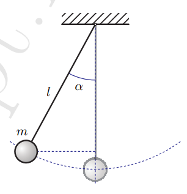
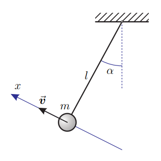
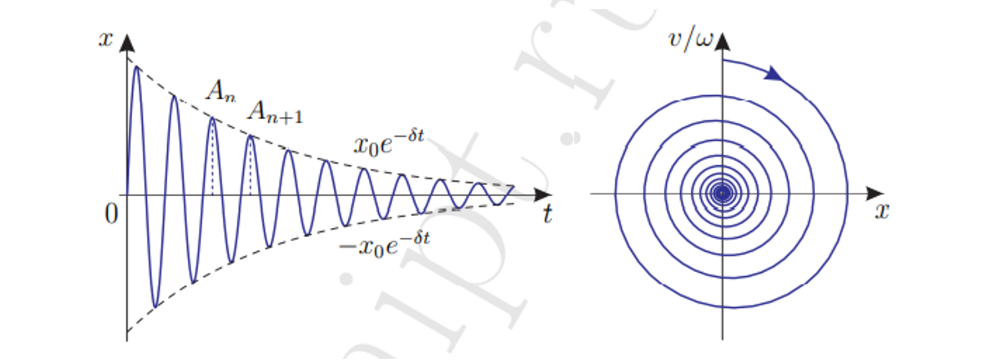
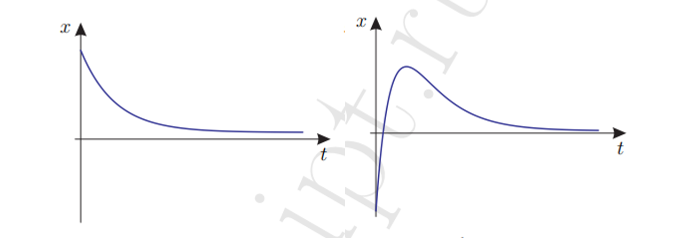

---
## Front matter
lang: ru-RU
title: Колебания цепочек(8)
author: |
	Гебриал Ибрам Есам Зекри НПИ-01-18 \	 
	Каримов Зуфар Исматович НПИ-01-18 \
	Волков Тимофей Евгеньевич НПИ-01-18 \
	Гаджиев Нурсултан Тофик оглы НПИ-01-18

## Formatting
toc: false
slide_level: 2
theme: metropolis
header-includes: 
 - \metroset{progressbar=frametitle,sectionpage=progressbar,numbering=fraction}
 - '\makeatletter'
 - '\beamer@ignorenonframefalse'
 - '\makeatother'
aspectratio: 43
section-titles: true
---

# Ввдение

## Математический маятник

Рассмотрим математический маятник: небольшой грузик массы m на нерастяжимой невесомой нити длины l.
Пусть этот маятник совершает малые колебания вблизи положения равновесия и в некоторый момент времени нить маятника составляет угол α с вертикалью (рис. -@fig:001). 

{ #fig:001 width=30% }

## 

$\frac{mv^2}{2}$ + mgl(1-cos$\alpha$)=$E_{0}, (1)$

где ноль потенциальной энергии принят в положении равновесия. Воспользовавшись условием, что колебания происходят с малой амплитудой (т. е. угол $\alpha$ мал), используем приближение cos $\alpha$ = 1 - $\frac{\alpha^2}{2}$ . 
Скорость движения грузика v = $\omega$ l = $\alpha$l, где  $\omega$ — мгновенная угловая скорость вращения. Тогда уравнение (1) принимает вид 

$\frac{ml^2 \alpha'}{2}$ +  $\frac{mgl \alpha}{2}$ =$E_{0}$, или $\alpha'^2$ + $\frac{g}{l}$ * $\alpha^2$ = $\frac{2 E_{0}}{ml^2}$

##

После дифференцирования имеем 

$\alpha''$ +  $\frac{g}{l}$ * $\alpha$ = 0

или, вводя обозначение $\omega_{0}^2$ = $\frac{g}{l}$, получаем 

$\alpha''$ +  $\omega_{0}^2$ * $\alpha$ = 0 (2)

аналогичное уравнению 

x'' +  $\omega_{0}^2$x = 0

Период колебаний такого маятника:          

T=$\frac{2 \pi}{\omega_{0}}$= 2 $\pi$ $\sqrt{\frac{1}{g}}$

##

Рассмотрим математический маятник длины l и массы m, совершающий малые колебания вблизи положения равновесия и испытывающий со стороны окружающей среды воздействие силы трения, величина которой пропорциональна скорости грузика маятника (рис. -@fig:002)

{ #fig:002 width=30% }

##

m*v'' = - $\beta$ v - mg sin $\alpha$

учитывая, что v=l$\alpha'$ , а колебания малые, получаем 

$\alpha$'' + $\frac{\beta}{m}$ * $\alpha$' + g * l * $\alpha$ = 0

или вводя обозначения $\delta$ = $\frac{\beta}{2m}$ и $\omega_{0}^2$ = $\frac{g}{l}$, находим $\alpha$'' + 2$\delta$ $\alpha''$ + $\omega_{0}^2$ = 0 (3)

В обоих приведенных примерах мы пришли к уравнению свободных затухающих гармонических колебаний: 

X'' + 2 $\delta$ x' + $\omega_{0}$ x =0. (4)
 
##

В зависимости от соотношения между $\delta$  и $\omega_{0}$ уравнение (4) будет иметь различные решения:

a) При $\omega_{0}$ > $\delta^2$ решение уравнения (4) имеет вид 

x(t) = $x_{0}$ $e^{-\delta t}$ cos($\omega$ t +$\varphi$), $\omega$ = $\sqrt{\omega_{0}^2-\delta^2}$ (5)

{ #fig:003 width=70% }

б) При $\omega_{0}^2$ < $\delta^2$ решение уравнения (4) имеет вид 

x(t) = $x_{01}$ $e^{-\delta t}$ $e^{\sqrt{(\delta^2-\omega_{0}^2)} t}$ + $x_{02}$ $e^{-\delta t}$ $e^{\sqrt{(\delta^2-\omega_{0}^2)} t}$ (6)

##

в) При $\omega_{0}^2$ = $\delta^2$ решение уравнения (4) имеет вид

x(t) = $x_{01}$ $e^{-\delta t}$ + $x_{02}$t $e^{-\delta t}$ (7)

{ #fig:004 width=70% }

# Заключение

