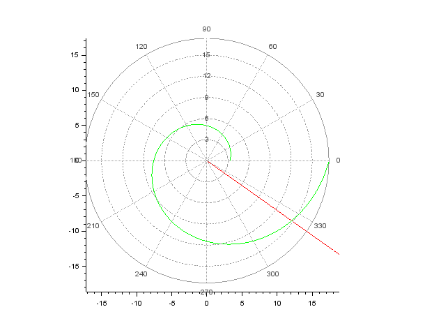
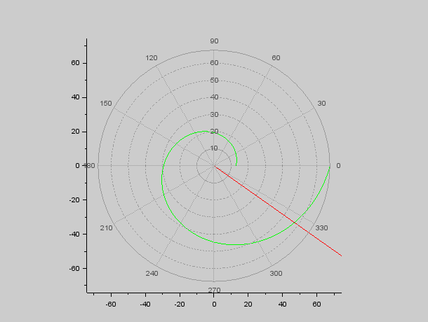

---
## Front matter
lang: ru-RU
title: Задача о погоне
author: |
	Гебриал Ибрам \inst{1}
	
institute: |
	\inst{1}RUDN University, Moscow, Russian Federation
	

## Formatting
toc: false
slide_level: 2
theme: metropolis
header-includes: 
 - \metroset{progressbar=frametitle,sectionpage=progressbar,numbering=fraction}
 - '\makeatletter'
 - '\beamer@ignorenonframefalse'
 - '\makeatother'
aspectratio: 43
section-titles: true
---

## цель работы

Решить задачу о погоне, построить графики с помощью sci.

## Задача о погоне

**Вариант 42**

На море в тумане катер береговой охраны преследует лодку браконьеров.
Через определенный промежуток времени туман рассеивается, и лодка
обнаруживается на расстоянии 16,1 км от катера. Затем лодка снова скрывается в
тумане и уходит прямолинейно в неизвестном направлении. Известно, что скорость
катера в 3,9 раза больше скорости браконьерской лодки.

## Задание

1. Запишите уравнение, описывающее движение катера, с начальными
условиями для двух случаев (в зависимости от расположения катера
относительно лодки в начальный момент времени).
2. Постройте траекторию движения катера и лодки для двух случаев.
3. Найдите точку пересечения траектории катера и лодки

# Выполнение работы

## первый шаг

Принимаем за $t_0=0, X_0=0$  - место нахождения лодки браконьеров в момент обнаружения, $X_0=k$   - место нахождения катера береговой охраны относительно лодки браконьеров в момент обнаружения лодки. Введем полярные координаты.

время вычисляется как $\frac{x}{υ}$ или $\frac{x+k}{υ}$ (для второго случая $\frac{x-k}{υ}$). 

## второй шаг

$x_1=\frac{k}{n+1}$ ,при $\theta=0$

$x_2=\frac{k}{n-1}$ ,при $\theta=-\pi$

## третий шаг

по теореме Пифагора можно найти тангенциальную скорость $υ_t= \sqrt{n^2 υ_r^2-v^2}$. Поскольку, радиальная скорость равна $υ$, то тангенциальную скорость находим из уравнения $υ_t= \sqrt{n^2 υ^2-υ^2 }$. Следовательно, $υ_τ=υ\sqrt{n^2-1}$.

Тогда получаем $r\frac{d\theta}{dt}=υ\sqrt{n^2-1}$

## четвертий шаг

Решение исходной задачи сводится к решению системы из двух дифференциальных уравнений 

$$
 \begin{cases}
   \frac{dr}{dt}=υ
	\\   
	r\frac{d\theta}{dt}=υ\sqrt{n^2-1}
 \end{cases}
$$

с начальными условиями

$$
 \begin{cases}
   \theta_0=0
   \\
	r_0=\frac{k}{n+1}
 \end{cases}
\
$$

$$
 \begin{cases}
   \theta_0=-\pi
   \\
	r_0=\frac{k}{n-1}
 \end{cases}
\
$$

## Результаты

Для случая 1 получил точку пересечения примерно (12,1 , - 8,5)  (рис. -@fig:003).  

{ #fig:003 width=70% }  

## Результаты

Для случая 2 получил точку пересечения примерно (47 , - 33)  (рис. -@fig:004). 

{ #fig:004 width=70% }

# Вывод

Решил задачу о погоне, построить графики с помощью sci

## {.standout}

Спасибо за внимание 
