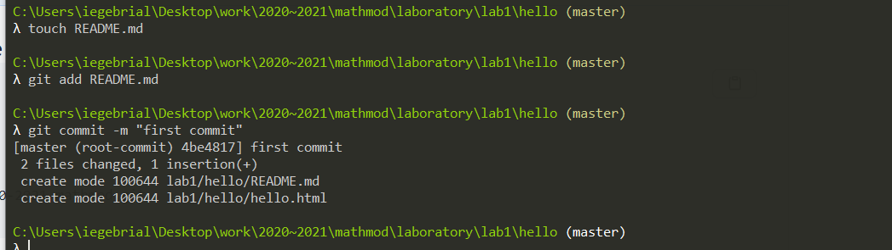

---
# Front matter
lang: ru-RU
title: "отчёта по лабораторной работе 1"

author: "Гебриал Ибрам Есам Зекри НПИ-01-18"

# Formatting
toc-title: "Содержание"
toc: true # Table of contents
toc_depth: 2
lof: true # List of figures
lot: true # List of tables
fontsize: 12pt
linestretch: 1.5
papersize: a4paper
documentclass: scrreprt
polyglossia-lang: russian
polyglossia-otherlangs: english
mainfont: PT Serif
romanfont: PT Serif
sansfont: PT Sans
monofont: PT Mono
mainfontoptions: Ligatures=TeX
romanfontoptions: Ligatures=TeX
sansfontoptions: Ligatures=TeX,Scale=MatchLowercase
monofontoptions: Scale=MatchLowercase
indent: true
pdf-engine: lualatex
header-includes:
  - \linepenalty=10 # the penalty added to the badness of each line within a paragraph (no associated penalty node) Increasing the value makes tex try to have fewer lines in the paragraph.
  - \interlinepenalty=0 # value of the penalty (node) added after each line of a paragraph.
  - \hyphenpenalty=50 # the penalty for line breaking at an automatically inserted hyphen
  - \exhyphenpenalty=50 # the penalty for line breaking at an explicit hyphen
  - \binoppenalty=700 # the penalty for breaking a line at a binary operator
  - \relpenalty=500 # the penalty for breaking a line at a relation
  - \clubpenalty=150 # extra penalty for breaking after first line of a paragraph
  - \widowpenalty=150 # extra penalty for breaking before last line of a paragraph
  - \displaywidowpenalty=50 # extra penalty for breaking before last line before a display math
  - \brokenpenalty=100 # extra penalty for page breaking after a hyphenated line
  - \predisplaypenalty=10000 # penalty for breaking before a display
  - \postdisplaypenalty=0 # penalty for breaking after a display
  - \floatingpenalty = 20000 # penalty for splitting an insertion (can only be split footnote in standard LaTeX)
  - \raggedbottom # or \flushbottom
  - \usepackage{float} # keep figures where there are in the text
  - \floatplacement{figure}{H} # keep figures where there are in the text
---

# Цель работы

 Подготовить отчёт по лабораторным работам, а также познакомиться
с основными возможностями разметки Markdown.

# Задание

1. Знакомиться с основными командами git
2. выполнить отчёт в виде markdown

# Выполнение лабораторной работы

## Знакомитьсяс git 

### Теоретические сведения
Git — одна из распределенных систем контроля версий.

GitHub — один из сервисов для использования системы контроля версий Git.

repository — некоторое хранилище файлов, ссылок на изменения в файлах
commit — отслеживание изменений, сохраняет разницу в изменениях
HEAD — (специальный указатель) символическая ссылка на последние изменения. Примечание: Не обязательно ссылается на commit. Может указывать на ветвь. Состояние — «Detached HEAD»
HEAD используется репозиторием для определения того, что выбрано с помощью checkout.
Обратите внимание на это различие: «head» (в нижнем регистре) относится к любому из названных заголовков в хранилище; «HEAD» (верхний регистр) относится исключительно к текущему активному заголовку(ссылке). Это различие часто используется в документации Git. HEAD может указывать на именованную вершину какой-либо ветки или на commit.
Объекты Git. Четыре типа объектов: Blob, Tree, Commit и References.
Ветвь определяется не в самом Git, а наследуется от операционной и файловой систем.
Более подробно об объектах Git вы можете прочитать в документации.

git сервисы — сервисы предоставляющие услуги для пользователей git.

Основные команды:

-git init

-git add

-git status

-git commit

-git clone

### Выполнение работы 

1. Вот сначала сделал простанство работы (рис. -@fig:001)

2. Создал страницу «Hello, World»		(рис. -@fig:002)

3. Чтобы создать git репозиторий из этого каталога, выполнил команду git init. (рис. -@fig:003)

4. Добавил файл в репозиторий. (рис. -@fig:004) (рис. -@fig:005)

5. Измените страницу «Hello, World» (рис. -@fig:006)

6. Проверял состояние рабочего каталога. (рис. -@fig:007)

git знает, что файл hello.html был изменен, но при этом эти изменения еще
не зафиксированы в репозитории.

.png){ #fig:001 width=70% }

.png){ #fig:002 width=70% }

{ #fig:003 width=70% }

{ #fig:004 width=70% }

{ #fig:005 width=70% }

.png){ #fig:006 width=70% }

.png){ #fig:007 width=70% }

7. выполнил команду git, чтобы проиндексировать изменения. Проверял
состояние. (рис. -@fig:008)

.png){ #fig:008 width=70% }

**Коммит изменений**

8. Сделайл коммит, добавил комментарий: «Added h1 tag» . (рис. -@fig:009)

.png){ #fig:009 width=70% }

9. Проверял состояние. (рис. -@fig:010)

.png){ #fig:010 width=70% }

**История**

10. Получил список произведенных изменений. (рис. -@fig:011)

.png){ #fig:011 width=70% }

11. Смотрел Однострочный формат истории. (рис. -@fig:012)

.png){ #fig:012 width=70% }

12. пермешение по версями. (рис. -@fig:013)

.png){ #fig:013 width=70% }

13. Потом проверяд содержимое файла hello.html. (рис. -@fig:014)

.png){ #fig:014 width=70% }

14. Вернился к последней версии в ветке master (рис. -@fig:015)

.png){ #fig:015 width=70% }

**Создание тегов версий**

15. создал тег первой версии а потом верлуся к старшему с помощью ^ значить родитель. (рис. -@fig:016)

.png){ #fig:016 width=70% }

16. проверял html. (рис. -@fig:017)

{ #fig:017 width=70% }

17. посмотрел теги в логе. (рис. -@fig:018)

{ #fig:018 width=70% }

18. Переключился на ветку master. (рис. -@fig:019)

.png){ #fig:019 width=70% }

19. Подключение удаленного репозитория на GitHub. . (рис. -@fig:020)

.png){ #fig:020 width=70% }

20. скачал шаблон отчёта и презентации. (рис. -@fig:021)

.png){ #fig:021 width=70% }

# Выводы

изучил основоные команды git and написал отчёт и презентацию в виде markdown.
