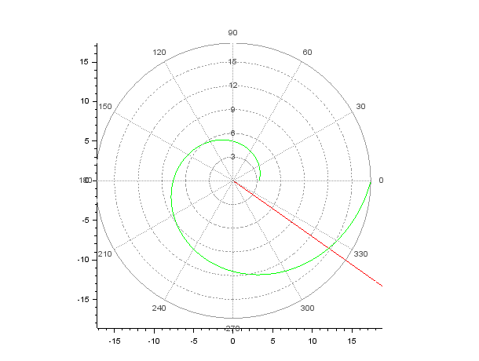
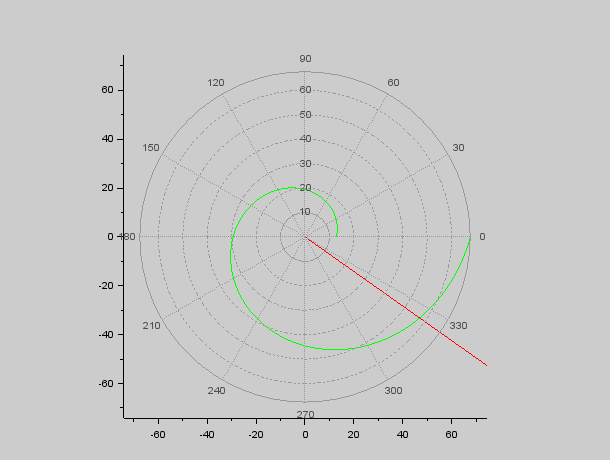

---
# Front matter
lang: ru-RU
title: "отчёта по лабораторной работе 2"

author: "Гебриал Ибрам Есам Зекри НПИ-01-18"

# Formatting
toc-title: "Содержание"
toc: true # Table of contents
toc_depth: 2
lof: true # List of figures
lot: true # List of tables
fontsize: 12pt
linestretch: 1.5
papersize: a4paper
documentclass: scrreprt
polyglossia-lang: russian
polyglossia-otherlangs: english
mainfont: PT Serif
romanfont: PT Serif
sansfont: PT Sans
monofont: PT Mono
mainfontoptions: Ligatures=TeX
romanfontoptions: Ligatures=TeX
sansfontoptions: Ligatures=TeX,Scale=MatchLowercase
monofontoptions: Scale=MatchLowercase
indent: true
pdf-engine: lualatex
header-includes:
  - \linepenalty=10 # the penalty added to the badness of each line within a paragraph (no associated penalty node) Increasing the value makes tex try to have fewer lines in the paragraph.
  - \interlinepenalty=0 # value of the penalty (node) added after each line of a paragraph.
  - \hyphenpenalty=50 # the penalty for line breaking at an automatically inserted hyphen
  - \exhyphenpenalty=50 # the penalty for line breaking at an explicit hyphen
  - \binoppenalty=700 # the penalty for breaking a line at a binary operator
  - \relpenalty=500 # the penalty for breaking a line at a relation
  - \clubpenalty=150 # extra penalty for breaking after first line of a paragraph
  - \widowpenalty=150 # extra penalty for breaking before last line of a paragraph
  - \displaywidowpenalty=50 # extra penalty for breaking before last line before a display math
  - \brokenpenalty=100 # extra penalty for page breaking after a hyphenated line
  - \predisplaypenalty=10000 # penalty for breaking before a display
  - \postdisplaypenalty=0 # penalty for breaking after a display
  - \floatingpenalty = 20000 # penalty for splitting an insertion (can only be split footnote in standard LaTeX)
  - \raggedbottom # or \flushbottom
  - \usepackage{float} # keep figures where there are in the text
  - \floatplacement{figure}{H} # keep figures where there are in the text
---

# Цель работы

 Решить задачу о погоне, построить графики с помощью sci.

# Задание

**Вариант 42**

На море в тумане катер береговой охраны преследует лодку браконьеров.
Через определенный промежуток времени туман рассеивается, и лодка
обнаруживается на расстоянии 16,1 км от катера. Затем лодка снова скрывается в
тумане и уходит прямолинейно в неизвестном направлении. Известно, что скорость
катера в 3,9 раза больше скорости браконьерской лодки.

1. Запишите уравнение, описывающее движение катера, с начальными
условиями для двух случаев (в зависимости от расположения катера
относительно лодки в начальный момент времени).
2. Постройте траекторию движения катера и лодки для двух случаев.
3. Найдите точку пересечения траектории катера и лодки


# Выполнение лабораторной работы

## Постановка задачи
1.1. Принимаем за $t_{0} = 0$, $x_{Л0} = 0$ -- место нахождения лодки браконьеров 
в момент обнаружения, $x_{К0} = 16,1$ км -- место нахождения катера береговой охраны 
относительно лодки браконьеров в момент обнаружения лодки.

1.2. Введем полярные координаты. Считаем, что полюс – это точка обнаружения лодки 
браконьеров $x_{Л0} (θ = x_{Л0} = 0)$, а полярная ось $r$ проходит через точку нахождения 
катера береговой охраны. (рис. -@fig:001)

{ #fig:001 width=70% }

1.3. Траектория катера должна быть такой, чтобы и катер, и лодка все время были 
на одном расстоянии от полюса $θ$, только в этом случае траектория катера пересечется с 
траекторией лодки. Поэтому для начала катер береговой охраны должен двигаться некоторое 
время прямолинейно, пока не окажется на том же расстоянии от полюса, что и лодка браконьеров. 
После этого катер береговой охраны должен двигаться вокруг полюса удаляясь от него с той же 
скоростью, что и лодка браконьеров.

1.4. Чтобы найти расстояние *x* (расстояние после которого катер начнет двигаться вокруг полюса), необходимо составить простое уравнение. Пусть через время *t* катер и лодка окажутся на одном расстоянии *x* от полюса. За это время лодка пройдет *x*, а катер *k-x* (или *k+x*, в зависимости от начального положения катера относительно полюса). Время, за которое они пройдут это расстояние, вычисляется как *x/v* или *(k-x)/3,9v* (во втором 
случае *(k+v)/3,9v*). Так как время одно и то же, то эти величины одинаковы.  
Тогда неизвестное расстояние *x* можно найти из следующего уравнения:
$\frac{x}{v}=\frac{k+x}{3,9v}$ и $\frac{x}{v}=\frac{k-x}{3,9v}$. Отсюда мы найдем два значения *x~1~*=*k*/4,9 и *x~2~*=*k*/2,9, задачу будем решать для
двух случаев.


1.5. После того, как катер береговой охраны окажется на одном расстоянии от полюса, что и лодка, он 
должен сменить прямолинейную траекторию и начать двигаться вокруг полюса удаляясь от него со скоростью 
лодки $v$. Для этого скорость катера раскладываем на две составляющие: $v_{r}$ – радиальная скорость и 
$v_{τ}$ – тангенциальная скорость.  (рис. -@fig:002).

{ #fig:002 width=70% }

Радиальная скорость – это скорость, с которой катер удаляется от полюса, $v_{r} = \frac{\partial r}{\partial t}$. Нам 
нужно, чтобы эта скорость была равна скорости лодки, поэтому полагаем $v_{r} = \frac{\partial r}{\partial t} = v$.

Тангенциальная скорость – это линейная скорость вращения катера относительно полюса. Она равна 
произведению угловой скорости на радиус, $v_{τ} = r\frac{\partial θ}{\partial t}$.

Из рис. -@fig:002 по теореме Пифагора: $v_{τ} = \sqrt{14,21}v$


1.6. Решение исходной задачи сводится к решению системы из двух дифференциальных уравнений:
\begin{equation*} 
  \begin{cases} 
    \frac{\partial r}{\partial t} = v 
    \\
    r\frac{\partial θ}{\partial t} = \sqrt{14,21}v; 
  \end{cases}
\end{equation*} 

Исключая из полученной системы производную по t, можно перейти к следующему уравнению:
$$ \frac{\partial r}{\partial θ} = \frac{r}{\sqrt{14,21}} $$

Решив это уравнение, я получу траекторию движения катера в полярных координатах. Начальные условия:
\begin{equation*}
  \begin{cases}
    θ_{0} = 0 
    \\ 
    r_{0} = x_{1} 
  \end{cases}
\end{equation*}

\begin{equation*}
  \begin{cases}
    θ_{0} = 0 
    \\ 
    r_{0} = x_{2} 
  \end{cases}
\end{equation*} 

## Моделирование задачи
```
n=3.9;

разница в скорости между катером и лодкой

k=16.1;

начальное расстояние между катером и лодкой

fi=3*%pi/4;

функция, описывающая движение катера береговой охраны

function dr=f(tetha, r)

dr=r/sqrt(n*n-1);

endfunction;

начальные условия в первом случае

r0=k/(n+1);

tetha0=0;

tetha=0:0.01:2*%pi;

r=ode(r0,tetha0,tetha,f);

функция, описывающая движение лодки браконьеров

function xt=f2(t)

xt=cos(fi)*t;

endfunction

t=0:1:800;

plot2d(t,f2(t),style = color('red'));

построение траектории движения браконьерской лодки

polarplot(tetha,r,style = color('green'));

построение траектории движения катера в полярных координатах

r0=k/(n-1);

tetha0=-%pi;

figure();

r=ode(r0,tetha0,tetha,f);

plot2d(t,f2(t),style = color('red'));

построение траектории движения браконьерской лодки

polarplot(tetha,r,style = color('green'));

построение траектории движения катера в полярных координатах
```


Для случая 1 получил точку пересечения примерно (12,1 , - 8,5)  (рис. -@fig:003).  


{ #fig:003 width=70% }  


Для случая 2 получил точку пересечения примерно (47 , - 33)  (рис. -@fig:004). 


{ #fig:004 width=70% }


# Выводы

Я решил задачу о погоне и построил графики с помощью sci.
