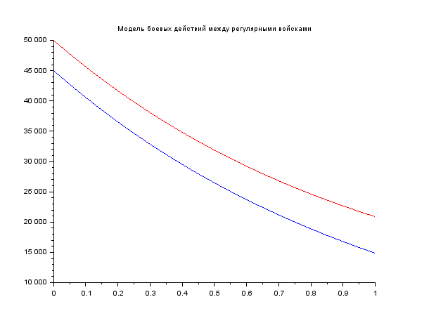
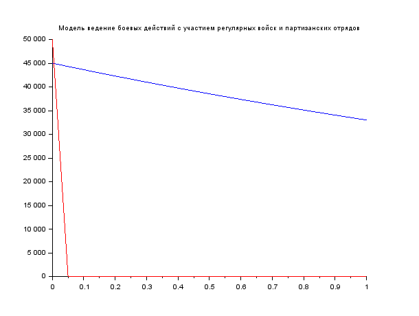

---
## Front matter
lang: ru-RU
title: Модель боевых действий
author: |
	Гебриал Ибрам \inst{1}
	
institute: |
	\inst{1}RUDN University, Moscow, Russian Federation
	

## Formatting
toc: false
slide_level: 2
theme: metropolis
header-includes: 
 - \metroset{progressbar=frametitle,sectionpage=progressbar,numbering=fraction}
 - '\makeatletter'
 - '\beamer@ignorenonframefalse'
 - '\makeatother'
aspectratio: 43
section-titles: true
---

## цель работы

Ознакомление с некоторыми простейшими моделями боевых действий – модели Ланчестера.

## Модель боевых действий

**Вариант 42**

Между страной Х и страной У идет война. Численность состава войск
исчисляется от начала войны, и являются временными функциями x(t) и y(t) . В
начальный момент времени страна Х имеет армию численностью 45 000 человек, а
в распоряжении страны У армия численностью в 50 000 человек. Для упрощения
модели считаем, что коэффициенты a, b, c, h постоянны. Также считаем P(t) и
Q(t) непрерывные функции.

## Задание

Постройте графики изменения численности войск армии Х и армии У для
следующих случаев:

1. Модель боевых действий между регулярными войсками

 $\frac{dx}{dt}$= -0.29x(t) - 0.67y(t)+|sin(t)+1|

 $\frac{dy}{dt}$= -0.6x(t) - 0.38y(t)+|cos(t)+1|
 
 2. Модель ведение боевых действий с участием регулярных войск и партизанских отрядов
 
 $\frac{dx}{dt}$= -0.31x(t) - 0.67y(t)+2*|sin(2t)|

 $\frac{dy}{dt}$= -0.42x(t) - 0.53y(t)+|cos(t)+1| 

# Выполнение работы

У нас как дано в задании что в начальный момент времени страна Х имеет армию численностью 45 000 человек, а
в распоряжении страны У армия численностью в 50 000 человек. 

Для упрощения модели считаем, что коэффициенты a,b ,c ,h постоянны. Также считаем P(t) и Q(t) непрерывные функции.

## Результаты

Изменение численности армии X и Y в процессе боевых действий при условии участия только регулярных войск (армия x --- синий, аримя y --- красный)( fig. -@fig:001).

{ #fig:001 width=70% }

## Результаты

Изменение численности армии X и Y в процессе боевых действий при условии участия регулярных войск и
партизанских отрядов (армия x --- синий, аримя y --- красный)(fig. -@fig:002).

{ #fig:002 width=70% }

# Вывод

Посмотрел некоторые простейшие модели боевых действий – модели Ланчестера.

## {.standout}

Спасибо за внимание 
