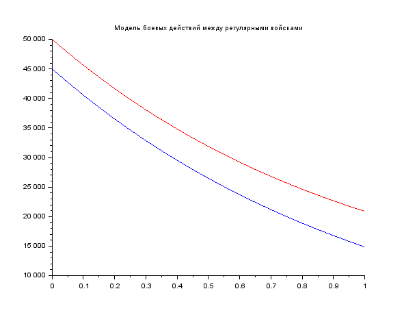
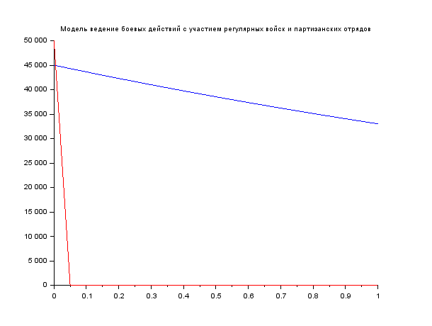

---
# Front matter
lang: ru-RU
title: "Отчёт по лабораторной работе 3"

author: "Гебриал Ибрам Есам Зекри НПИ-01-18"

# Formatting
toc-title: "Содержание"
toc: true # Table of contents
toc_depth: 2
lof: true # List of figures
lot: true # List of tables
fontsize: 12pt
linestretch: 1.5
papersize: a4paper
documentclass: scrreprt
polyglossia-lang: russian
polyglossia-otherlangs: english
mainfont: PT Serif
romanfont: PT Serif
sansfont: PT Sans
monofont: PT Mono
mainfontoptions: Ligatures=TeX
romanfontoptions: Ligatures=TeX
sansfontoptions: Ligatures=TeX,Scale=MatchLowercase
monofontoptions: Scale=MatchLowercase
indent: true
pdf-engine: lualatex
header-includes:
  - \linepenalty=10 # the penalty added to the badness of each line within a paragraph (no associated penalty node) Increasing the value makes tex try to have fewer lines in the paragraph.
  - \interlinepenalty=0 # value of the penalty (node) added after each line of a paragraph.
  - \hyphenpenalty=50 # the penalty for line breaking at an automatically inserted hyphen
  - \exhyphenpenalty=50 # the penalty for line breaking at an explicit hyphen
  - \binoppenalty=700 # the penalty for breaking a line at a binary operator
  - \relpenalty=500 # the penalty for breaking a line at a relation
  - \clubpenalty=150 # extra penalty for breaking after first line of a paragraph
  - \widowpenalty=150 # extra penalty for breaking before last line of a paragraph
  - \displaywidowpenalty=50 # extra penalty for breaking before last line before a display math
  - \brokenpenalty=100 # extra penalty for page breaking after a hyphenated line
  - \predisplaypenalty=10000 # penalty for breaking before a display
  - \postdisplaypenalty=0 # penalty for breaking after a display
  - \floatingpenalty = 20000 # penalty for splitting an insertion (can only be split footnote in standard LaTeX)
  - \raggedbottom # or \flushbottom
  - \usepackage{float} # keep figures where there are in the text
  - \floatplacement{figure}{H} # keep figures where there are in the text
---

# Цель работы

Ознакомление с некоторыми простейшими моделями боевых действий – модели Ланчестера.

# Задание

**Вариант 42**

Между страной Х и страной У идет война. Численность состава войск
исчисляется от начала войны, и являются временными функциями x(t) и y(t) . В
начальный момент времени страна Х имеет армию численностью 45 000 человек, а
в распоряжении страны У армия численностью в 50 000 человек. Для упрощения
модели считаем, что коэффициенты a, b, c, h постоянны. Также считаем P(t) и
Q(t) непрерывные функции.
Постройте графики изменения численности войск армии Х и армии У для
следующих случаев:

1. Модель боевых действий между регулярными войсками

 $\frac{dx}{dt}$= -0.29x(t) - 0.67y(t)+|sin(t)+1|

 $\frac{dy}{dt}$= -0.6x(t) - 0.38y(t)+|cos(t)+1|
 
 2. Модель ведение боевых действий с участием регулярных войск и партизанских отрядов
 
 $\frac{dx}{dt}$= -0.31x(t) - 0.67y(t)+2*|sin(2t)|

 $\frac{dy}{dt}$= -0.42x(t) - 0.53y(t)+|cos(t)+1| 

# Выполнение лабораторной работы

## Постановка задачи
Рассмотрим некоторые простейшие модели боевых действий – модели
Ланчестера. В противоборстве могут принимать участие как регулярные войска,
так и партизанские отряды. В общем случае главной характеристикой соперников
являются численности сторон. Если в какой-то момент времени одна из
численностей обращается в нуль, то данная сторона считается проигравшей (при
условии, что численность другой стороны в данный момент положительна). 

Вот мы расмотрим два случая:

1. Боевые действия между регулярными войсками

2. Боевые действия с участием регулярных войск и партизанских отрядов.

В первом случае численность регулярных войск определяется тремя факторами:

* скорость уменьшения численности войск из-за причин, не связанных с боевыми действиями (болезни, травмы, дезертирство);

* скорость потерь, обусловленных боевыми действиями уровнем вооружения, профессионализмом солдат и т.п.);

* скорость поступления подкрепления (задаётся некоторой функцией от времени).

В этом случае модель боевых действий между регулярными войсками описывается следующим образом


 $\frac{dx}{dt}$= -a(t)x(t) - b(t)y(t)+P(t)

 $\frac{dy}{dt}$= -c(t)x(t) - h(t)y(t)+Q(t)
 
 Потери, не связанные с боевыми действиями, описывают члены -a(t)x(t) и
-h(t)y(t) , члены -b(t)y(t) и -c(t)x(t) отражают потери на поле боя.
Коэффициенты b(t) и c(t) указывают на эффективность боевых действий со
стороны у и х соответственно, a(t),h(t)-величины, характеризующие степень
влияния различных факторов на потери. Функции P(t),Q(t) учитывают возможность подхода подкрепления к войскам Х и У в течение одного дня.

Во втором случае в борьбу добавляются партизанские отряды. Нерегулярные
войска в отличии от постоянной армии менее уязвимы, так как действуют скрытно,
в этом случае сопернику приходится действовать неизбирательно, по площадям,
занимаемым партизанами. Поэтому считается, что тем потерь партизан,
проводящих свои операции в разных местах на некоторой известной территории,
пропорционален не только численности армейских соединений, но и численности
самих партизан. В результате модель принимает вид:

 $\frac{dx}{dt}$= -a(t)x(t) - b(t)y(t)+P(t)

 $\frac{dy}{dt}$= -c(t)x(t)y(t) - h(t)y(t)+Q(t)
 
В этой системе все величины имею тот же смысл, что и в системе первого случая.

## Выполнение работы

У нас как дано в задании что в начальный момент времени страна Х имеет армию численностью 45 000 человек, а
в распоряжении страны У армия численностью в 50 000 человек. 

Для упрощения модели считаем, что коэффициенты a,b ,c ,h постоянны. Также считаем P(t) и Q(t) непрерывные функции.

### Модель боевых действий между регулярными войсками

Дано:

 $\frac{dx}{dt}$= -0.29x(t) - 0.67y(t)+|sin(t)+1|

 $\frac{dy}{dt}$= -0.6x(t) - 0.38y(t)+|cos(t)+1|
 
**Тогда у нас начальные условии:**

x0= 45000

y0= 50000

a= 0.29

b = 0.67

c= 0.6

h= 0.38

P(t) = sin(t)+1

Q(t) = cos(t)+1

**Код программы** 

```
//начальные условия
x0=45000;//численность первой армии
y0=50000;//численность второй армии
t0=0;//начальный момент времени

//константа, характеризующая степень 
влияния различных факторов на потери

a=0.29;

 //эффективность боевых действий армии у
b=0.67;

//эффективность боевых действий армии х
c=0.6;

//константа, характеризующая степень 
влияния различных факторов на потери
h=0.38;

//предельный момент времени
tmax=1;

//шаг изменения времени
dt=.05;

t=[t0:dt:tmax];

//возможность подхода подкрепления к армии х
function p=P(t)
   p=sin(t)+1;
endfunction

//возможность подхода подкрепления к армии у
function q=Q(t)
   q=cos(t)+1;
endfunction

//Система дифференциальных уравнений
function dy= syst(t,y)
//изменение численности первой армии
    dy(1)=-a*y(1)-b*y(2)+abs(P(t));
//изменение численности второй армии
    dy(2)=-c*y(1)-h*y(2)+abs(Q(t));
endfunction
//Вектор начальных условий
v0=[x0;y0];
//Решение системы
y=ode(v0,t0,t,syst);

//Построение графиков решений
scf(0);

//График изменения численности армии х(синий)
plot2d(t,y(1,:),style=2);

xtitle('Модель боевых действий между регулярными войсками');

//График изменения численности армии у (красный)
plot2d(t,y(2,:),style=5);

```

График изменения численности войск (армия x --- синий, аримя y --- красный)( fig. -@fig:001).

{ #fig:001 width=70% }

### Модель ведение боевых действий с участием регулярных войск и партизанских отрядов

Дано:

 $\frac{dx}{dt}$= -0.31x(t) - 0.67y(t)+2*|sin(2t)|

 $\frac{dy}{dt}$= -0.42x(t) - 0.53y(t)+|cos(t)+1| 
 
**Тогда у нас начальные условии:**

x0= 45000

y0= 50000

a= 0.31

b = 0.67

c= 0.42

h= 0.53

P(t) = sin(2t)

Q(t) = cos(t)+1

**Код программы** 


```

//начальные условия
x0=45000;//численность первой армии
y0=50000;//численность второй армии
t0=0;//начальный момент времени

//константа, характеризующая степень 
влияния различных факторов на потери

a=0.31;

 //эффективность боевых действий армии у
b=0.67;

//эффективность боевых действий армии х
c=0.42;

//константа, характеризующая степень 
влияния различных факторов на потери
h=0.53;

//предельный момент времени
tmax=1;

//шаг изменения времени
dt=.05;

t=[t0:dt:tmax];

//возможность подхода подкрепления к армии х
function p=P(t)
   p=sin(2*t);
endfunction

//возможность подхода подкрепления к армии у
function q=Q(t)
   q=cos(t)+1;
endfunction

//Система дифференциальных уравнений
function dy= syst(t,y)
//изменение численности первой армии
    dy(1)=-a*y(1)-b*y(2)+2*(abs(P(t)));
//изменение численности второй армии
    dy(2)=-c*y(1)*y(2)-h*y(2)+abs(Q(t));
endfunction
//Вектор начальных условий
v0=[x0;y0];
//Решение системы
y=ode(v0,t0,t,syst);

//Построение графиков решений
scf(0);

//График изменения численности армии х(синий)
plot2d(t,y(1,:),style=2);

xtitle('Модель ведение боевых действий с участием 
регулярных войск и партизанских отрядов');

//График изменения численности армии у (красный)
plot2d(t,y(2,:),style=5);

```

Вот как мы видим что x побеждает

График изменения численности войск (армия x --- синий, аримя y --- красный)(fig. -@fig:002).

{ #fig:002 width=70% }

# Выводы

Посмотрел некоторые простейшие модели боевых действий – модели Ланчестера.
