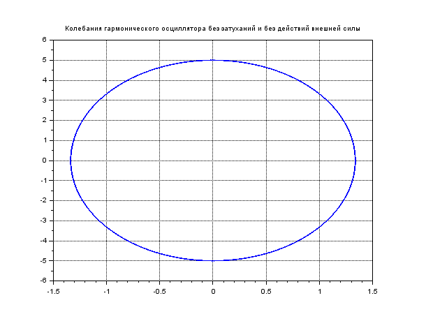
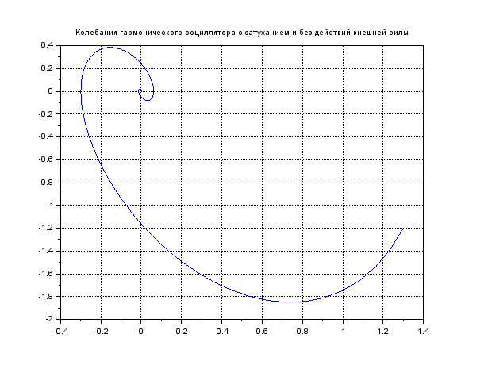
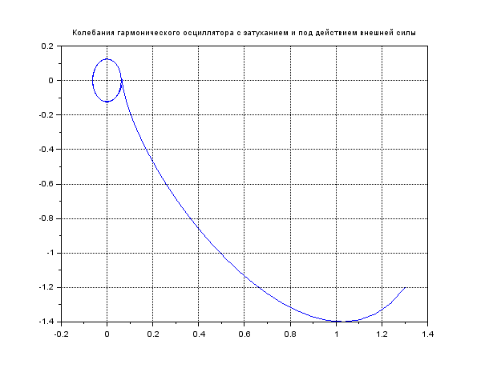

---
## Front matter
lang: ru-RU
title: Модель гармонических колебаний
author: |
	Гебриал Ибрам \inst{1}
	
institute: |
	\inst{1}RUDN University, Moscow, Russian Federation
	

## Formatting
toc: false
slide_level: 2
theme: metropolis
header-includes: 
 - \metroset{progressbar=frametitle,sectionpage=progressbar,numbering=fraction}
 - '\makeatletter'
 - '\beamer@ignorenonframefalse'
 - '\makeatother'
aspectratio: 43
section-titles: true
---

# Цель работы

## Цель работы

Ознакомление с моделью линейного гармонического осциллятора.

## Модель гармонических колебаний

**Вариант 42**

Постройте фазовый портрет гармонического осциллятора и решение уравнения
гармонического осциллятора для следующих случаев

## Задание

1. Колебания гармонического осциллятора без затуханий и без действий внешней силы

x'' + 14x = 0
 
 2. Колебания гармонического осциллятора c затуханием и без действий внешней силы
 
x'' + 2x' + 5x = 0

3. Колебания гармонического осциллятора c затуханием и под действием внешней силы

x'' + 4x' +5x = 0.5cos(2t) 

# Выполнение работы

Уравнение колебания гармонического осциллятора будет иметь вид

$$
x'' + g * x' + w * x = f(t)
$$

где 

w - частота

g - затухание

$f(t)$ --- действие внешней силы

## Выполнение работы

Уравнение второго порядка можно представить в виде системы двух
уравнений первого порядка:

$$
x' = y
$$

$$
y' = - wx - gy - f(t)
$$ 

На интервале $t \in [0;47]$ (шаг 0.05) 
с начальными условиями $x_{0} = 1.3$, $y_{0} = -1.2$

## Колебания гармонического осциллятора без затуханий и без действий внешней силы

Фазовый портрет гармонического осциллятора ( fig. -@fig:001).

{ #fig:001 width=70% }

## Колебания гармонического осциллятора c затуханием и без действий внешней силы

Фазовый портрет гармонического осциллятора ( fig. -@fig:002).

{ #fig:002 width=70% }

## Колебания гармонического осциллятора c затуханием и под действием внешней силы

Фазовый портрет гармонического осциллятора ( fig. -@fig:003).

{ #fig:003 width=70% }

# Вывод

Посмотрел модель линейного гармонического осциллятора.

## {.standout}

Спасибо за внимание 
