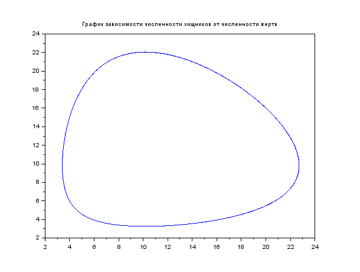
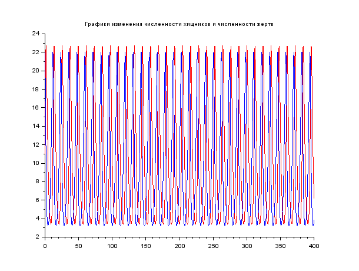
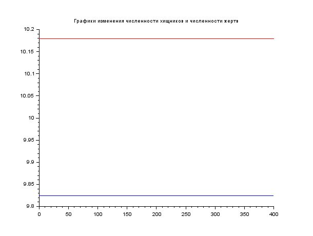

---
## Front matter
lang: ru-RU
title: Модель хищник-жертва
author: |
	Гебриал Ибрам \inst{1}
	
institute: |
	\inst{1}RUDN University, Moscow, Russian Federation
	

## Formatting
toc: false
slide_level: 2
theme: metropolis
header-includes: 
 - \metroset{progressbar=frametitle,sectionpage=progressbar,numbering=fraction}
 - '\makeatletter'
 - '\beamer@ignorenonframefalse'
 - '\makeatother'
aspectratio: 43
section-titles: true
---

# Цель работы

## Цель работы

Построение модели хищник-жертва.

## Модель хищник-жертва

**Вариант 42**

Для модели «хищник-жертва»:
$$ \begin{cases} \frac{dx}{dt}=-0.56x(t)+0.057x(t)y(t) \\ \frac{dx}{dt}=0.57x(t)-0.056x(t)y(t) \end{cases} $$ 

## Задание

1. Постройте график зависимости численности хищников от численности жертв,
2. Постройте графики изменения численности хищников и численности жертв при
следующих начальных условиях:
$x_0 = 11, y_0 = 22$. 
3. Найдите стационарное состояние системы.  

# Выполнение работы

Для модели «хищник-жертва»:  
$$ \begin{cases} \frac{dx}{dt}=-ax(t)+bx(t)y(t) \\ \frac{dy}{dt}=cx(t)-dx(t)y(t) \end{cases} $$ 
$$ \begin{cases} \frac{dx}{dt}=-0.56x(t)+0.057x(t)y(t) \\ \frac{dx}{dt}=0.57x(t)-0.056x(t)y(t) \end{cases} $$

$a,d$ - коэффициенты смертности

$b,c$ - коэффициенты прироста популяции

## Выполнение работы

У нас дано:

a = 0.56 (коэффициент естественной смертности хищников)  

b = 0.057 (коэффициент увеличения числа хищников) 

c = 0.57 (коэффициент естественного прироста жертв)  

d = 0.056 (коэффициент смертности жертв)  

Начальное число хищников -- $x_0 = 11$, начальное число жертв -- $y_0 = 22$. 

## Найти стационарное состояние системы

$x_0=\frac{c}{d}, y_0=\frac{a}{b}$

$x_0=\frac{0.57}{0.056}=10.1, y_0=\frac{0.56}{0.057}=9.8$

# результаты 

1. Постройл график зависимости численности хищников от численности жертв (рис. -@fig:001)

{ #fig:001 width=70% }  

## результаты 

2. Построил графики изменения численности хищников и численности жертв при следующих начальных условиях: $x_0=11, y_0=22$ (рис. -@fig:002)

{ #fig:002 width=70% } 

## результаты 

3. Построил графики изменения численности хищников и численности жертв при следующих стационарного состояния системы:

{ #fig:003 width=70% } 

# Вывод

Постмотрел модели хищник-жертва и постройл  график зависимости численности хищников от численности жертв,
а также графики изменения численности хищников и численности жертв при начальных условиях и при стационарных состояниях системы.

## {.standout}

Спасибо за внимание 
