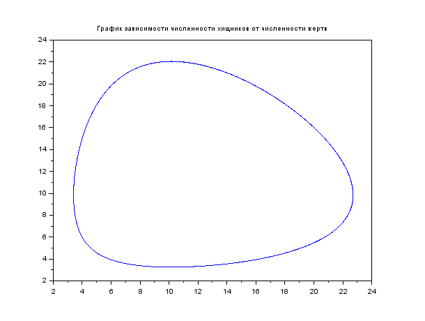
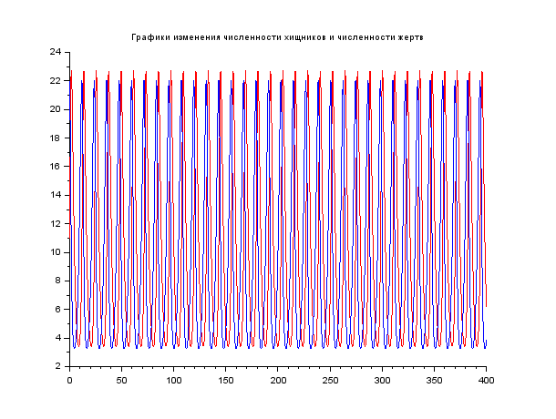
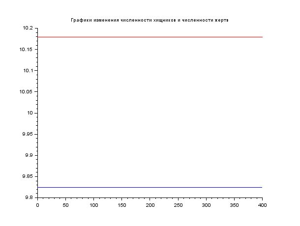

---
# Front matter
lang: ru-RU
title: "Отчёт по лабораторной работе 5"

author: "Гебриал Ибрам Есам Зекри НПИ-01-18"

# Formatting
toc-title: "Содержание"
toc: true # Table of contents
toc_depth: 2
lof: true # List of figures
lot: true # List of tables
fontsize: 12pt
linestretch: 1.5
papersize: a4paper
documentclass: scrreprt
polyglossia-lang: russian
polyglossia-otherlangs: english
mainfont: PT Serif
romanfont: PT Serif
sansfont: PT Sans
monofont: PT Mono
mainfontoptions: Ligatures=TeX
romanfontoptions: Ligatures=TeX
sansfontoptions: Ligatures=TeX,Scale=MatchLowercase
monofontoptions: Scale=MatchLowercase
indent: true
pdf-engine: lualatex
header-includes:
  - \linepenalty=10 # the penalty added to the badness of each line within a paragraph (no associated penalty node) Increasing the value makes tex try to have fewer lines in the paragraph.
  - \interlinepenalty=0 # value of the penalty (node) added after each line of a paragraph.
  - \hyphenpenalty=50 # the penalty for line breaking at an automatically inserted hyphen
  - \exhyphenpenalty=50 # the penalty for line breaking at an explicit hyphen
  - \binoppenalty=700 # the penalty for breaking a line at a binary operator
  - \relpenalty=500 # the penalty for breaking a line at a relation
  - \clubpenalty=150 # extra penalty for breaking after first line of a paragraph
  - \widowpenalty=150 # extra penalty for breaking before last line of a paragraph
  - \displaywidowpenalty=50 # extra penalty for breaking before last line before a display math
  - \brokenpenalty=100 # extra penalty for page breaking after a hyphenated line
  - \predisplaypenalty=10000 # penalty for breaking before a display
  - \postdisplaypenalty=0 # penalty for breaking after a display
  - \floatingpenalty = 20000 # penalty for splitting an insertion (can only be split footnote in standard LaTeX)
  - \raggedbottom # or \flushbottom
  - \usepackage{float} # keep figures where there are in the text
  - \floatplacement{figure}{H} # keep figures where there are in the text
---

# Цель работы

Построение модели хищник-жертва.

# Задание

**Вариант 42**

Для модели «хищник-жертва»:
$$ \begin{cases} \frac{dx}{dt}=-0.56x(t)+0.057x(t)y(t) \\ \frac{dx}{dt}=0.57x(t)-0.056x(t)y(t) \end{cases} $$ 
Постройте график зависимости численности хищников от численности жертв,
а также графики изменения численности хищников и численности жертв при
следующих начальных условиях:
$x_0 = 11, y_0 = 22$. Найдите стационарное
состояние системы.  

# Выполнение лабораторной работы

## Постановка задачи

Простейшая модель взаимодействия двух видов типа «хищник — жертва» -
модель Лотки-Вольтерры. Данная двувидовая модель основывается на
следующих предположениях:

1. Численность популяции жертв x и хищников y зависят только от времени (модель не учитывает пространственное распределение популяции на занимаемой территории).

2. В отсутствии взаимодействия численность видов изменяется по модели Мальтуса, при этом число жертв увеличивается, а число хищников падает.

3. Естественная смертность жертвы и естественная рождаемость хищника считаются несущественными.

4. Эффект насыщения численности обеих популяций не учитывается.

5. Скорость роста численности жертв уменьшается пропорционально численности хищников.

$$ \begin{cases} \frac{dx}{dt}=-ax(t)+bx(t)y(t) \\ \frac{dy}{dt}=cx(t)-dx(t)y(t) \end{cases} $$ (1)

В этой модели $x$ – число жертв, $y$ - число хищников. Коэффициент a
описывает скорость естественного прироста числа жертв в отсутствие хищников, $с$
- естественное вымирание хищников, лишенных пищи в виде жертв. Вероятность
взаимодействия жертвы и хищника считается пропорциональной как количеству
жертв, так и числу самих хищников (xy). Каждый акт взаимодействия уменьшает
популяцию жертв, но способствует увеличению популяции хищников (члены -bxy
и dxy в правой части уравнения).


{ #fig:001 width=70% }

Математический анализ этой (жесткой) модели показывает, что имеется
стационарное состояние (A на рис. -@fig:001), всякое же другое начальное состояние (B) приводит к периодическому колебанию численности как жертв, так и хищников,
так что по прошествии некоторого времени система возвращается в состояние B.

Стационарное состояние системы (1) (положение равновесия, не зависящее
от времени решение) будет в точке: $x_0=\frac{c}{d}, y_0=\frac{a}{b}$.

Если начальные значения
задать в стационарном состоянии $x(0) = x_0 , y(0) =  y_0$ , то в любой момент времени
численность популяций изменяться не будет. При малом отклонении от положения
равновесия численности как хищника, так и жертвы с течением времени не
возвращаются к равновесным значениям, а совершают периодические колебания
вокруг стационарной точки. Амплитуда колебаний и их период определяется
начальными значениями численностей x(0) , y(0). Колебания совершаются в
противофазе.


## Выполнение работы

Для модели «хищник-жертва»:  
$$ \begin{cases} \frac{dx}{dt}=-ax(t)+bx(t)y(t) \\ \frac{dy}{dt}=cx(t)-dx(t)y(t) \end{cases} $$ 
$$ \begin{cases} \frac{dx}{dt}=-0.56x(t)+0.057x(t)y(t) \\ \frac{dx}{dt}=0.57x(t)-0.056x(t)y(t) \end{cases} $$

$a,d$ - коэффициенты смертности

$b,c$ - коэффициенты прироста популяции

У нас дано:

a = 0.56 (коэффициент естественной смертности хищников)  

b = 0.057 (коэффициент увеличения числа хищников) 

c = 0.57 (коэффициент естественного прироста жертв)  

d = 0.056 (коэффициент смертности жертв)  

Начальное число хищников -- $x_0 = 11$, начальное число жертв -- $y_0 = 22$. 

Код программы

```
a=0.56;коэффициент естественной смертности хищников
b=0.057;коэффициент увеличения числа хищников
c=0.57;// коэффициент естественного прироста жертв
d=0.056;// коэффициент смертности жертв

function dx=syst2(t,x)
    dx(1)=-a*x(1)+b* x(1)*x(2);
    dx(2)=c*x(2)-d* x(1)*x(2);
endfunction

t0=0;
//стационарное состояние системы.
x01=c/d;
y01=a/b;
//x0=[11;22];////начальное значение x и у
 (популяция хищников и популяция жертв)
x0=[x01;y01];

t=[0:0.1:400];

y= ode(x0,t0,t,syst2);
n=size(y,"c");

//переписываем отдельно
for i=1:n
    y2(i)=y(2,i);
    y1(i)=y(1,i);  
end
//xtitle('График зависимости численности 
хищников от численности жертв');
//построение графика зависимости изменения 
численности хищников от изменения численности жертв
//plot(y1,y2);
xtitle('Графики изменения численности 
хищников и численности жертв');

 

//построение графика колебаний изменения 
числа популяции хищников
plot2d(t,y1,style= color ('red'));

//построение графика колебаний изменения 
числа популяции жертв
plot2d(t,y2,style= color ('blue'));

```

1. Постройл график зависимости численности хищников от численности жертв (рис. -@fig:002)

{ #fig:002 width=70% }  

2. Построил графики изменения численности хищников и численности жертв при следующих начальных условиях: $x_0=11, y_0=22$ (рис. -@fig:003)

{ #fig:003 width=70% } 

3. Нашёл стационарное состояние системы

$x_0=\frac{c}{d}, y_0=\frac{a}{b}$, $x_0=\frac{0.57}{0.056}=10.1, y_0=\frac{0.56}{0.057}=9.8$ убедился что числа жертв и хищников не меняется во времени (рис. -@fig:004)

{ #fig:004 width=70% } 


# Выводы

Постмотрел модели хищник-жертва и постройл  график зависимости численности хищников от численности жертв,
а также графики изменения численности хищников и численности жертв при начальных условиях и при стационарных состояниях системы.
