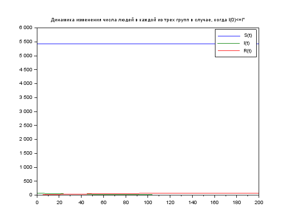
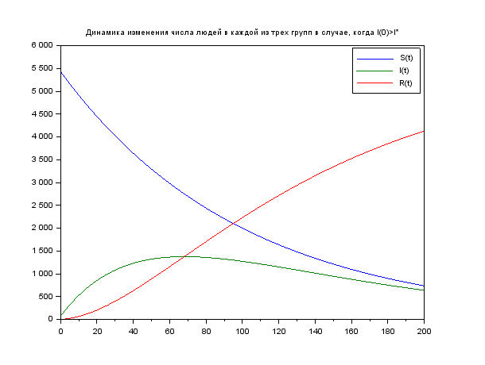

---
## Front matter
lang: ru-RU
title: Задача об эпидемии
author: |
	Гебриал Ибрам \inst{1}
	
institute: |
	\inst{1}RUDN University, Moscow, Russian Federation
	

## Formatting
toc: false
slide_level: 2
theme: metropolis
header-includes: 
 - \metroset{progressbar=frametitle,sectionpage=progressbar,numbering=fraction}
 - '\makeatletter'
 - '\beamer@ignorenonframefalse'
 - '\makeatother'
aspectratio: 43
section-titles: true
---

# Цель работы

## Цель работы

Посмотреть простейшую модель эпидемии.

## Задача об эпидемии

**Вариант 42**

На одном острове вспыхнула эпидемия. Известно, что из всех проживающих
на острове (N=5 500) в момент начала эпидемии (t=0) число заболевших людей
(являющихся распространителями инфекции) I(0)=70, А число здоровых людей с
иммунитетом к болезни R(0)=2. Таким образом, число людей восприимчивых к
болезни, но пока здоровых, в начальный момент времени S(0)=N-I(0)- R(0).

## Задание

Постройте графики изменения числа особей в каждой из трех групп.
Рассмотрите, как будет протекать эпидемия в случае: 

1. если $I(0) \le I^*$
2. если $I(0) > I^*$

# Выполнение работы
Постоянные пропорциональности $\alpha$=0.01, $\beta$=0.02 --- это коэффициенты заболеваемости
и выздоровления соответственно.

N=5500 -общая численность популяции

I0=70 - количество инфицированных особей в начальный момент времени

R0=2 - количество здоровых особей с иммунитетом в начальный момент времени

S0= N - I0 - R0 количество восприимчивых к болезни особей в начальный момент времени

## Выполнение работы

Первая случая $I(0) \le I^*$

function dx=syst(t,x)

    dx(1)=0;

    dx(2)=- b*x(2);

    dx(3) = b*x(2);

endfunction

##

Вторая случая  $I(0) > I^*$

function dx=syst(t,x)

    dx(1)=-a*x(1);

    dx(2)=a*x(1)- b*x(2);

    dx(3) = b*x(2);

endfunction

# Результат

## Для $I(0) \le I^*$

Динамика изменения числа людей в каждой из трех групп в случае, когда $I(0) \le I^*$ ( fig. -@fig:001).

{ #fig:001 width=70% }

## Для $I(0) > I^*$

Динамика изменения числа людей в каждой из трех групп в случае, когда $I(0) > I^*$ ( fig. -@fig:002).

{ #fig:002 width=70% }

# Вывод

Рассмотрел простейшую модель эпидемии.

## {.standout}

Спасибо за внимание 
