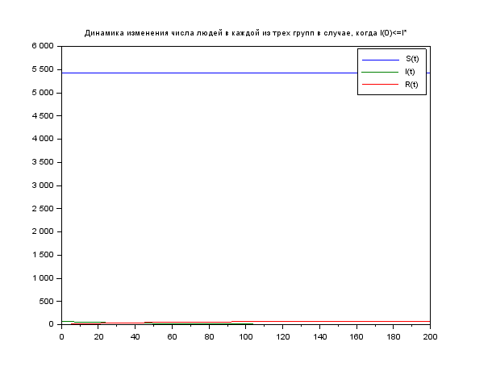
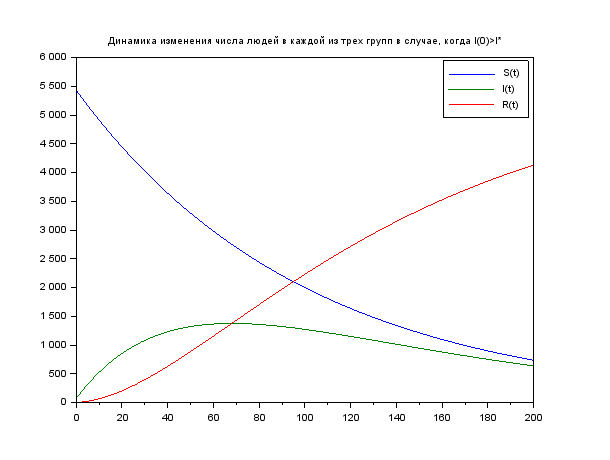

---
# Front matter
lang: ru-RU
title: "Отчёт по лабораторной работе 6"

author: "Гебриал Ибрам Есам Зекри НПИ-01-18"

# Formatting
toc-title: "Содержание"
toc: true # Table of contents
toc_depth: 2
lof: true # List of figures
lot: true # List of tables
fontsize: 12pt
linestretch: 1.5
papersize: a4paper
documentclass: scrreprt
polyglossia-lang: russian
polyglossia-otherlangs: english
mainfont: PT Serif
romanfont: PT Serif
sansfont: PT Sans
monofont: PT Mono
mainfontoptions: Ligatures=TeX
romanfontoptions: Ligatures=TeX
sansfontoptions: Ligatures=TeX,Scale=MatchLowercase
monofontoptions: Scale=MatchLowercase
indent: true
pdf-engine: lualatex
header-includes:
  - \linepenalty=10 # the penalty added to the badness of each line within a paragraph (no associated penalty node) Increasing the value makes tex try to have fewer lines in the paragraph.
  - \interlinepenalty=0 # value of the penalty (node) added after each line of a paragraph.
  - \hyphenpenalty=50 # the penalty for line breaking at an automatically inserted hyphen
  - \exhyphenpenalty=50 # the penalty for line breaking at an explicit hyphen
  - \binoppenalty=700 # the penalty for breaking a line at a binary operator
  - \relpenalty=500 # the penalty for breaking a line at a relation
  - \clubpenalty=150 # extra penalty for breaking after first line of a paragraph
  - \widowpenalty=150 # extra penalty for breaking before last line of a paragraph
  - \displaywidowpenalty=50 # extra penalty for breaking before last line before a display math
  - \brokenpenalty=100 # extra penalty for page breaking after a hyphenated line
  - \predisplaypenalty=10000 # penalty for breaking before a display
  - \postdisplaypenalty=0 # penalty for breaking after a display
  - \floatingpenalty = 20000 # penalty for splitting an insertion (can only be split footnote in standard LaTeX)
  - \raggedbottom # or \flushbottom
  - \usepackage{float} # keep figures where there are in the text
  - \floatplacement{figure}{H} # keep figures where there are in the text
---

# Цель работы

Посмотреть простейшую модель эпидемии.

# Задание

**Вариант 42**

На одном острове вспыхнула эпидемия. Известно, что из всех проживающих
на острове (N=5 500) в момент начала эпидемии (t=0) число заболевших людей
(являющихся распространителями инфекции) I(0)=70, А число здоровых людей с
иммунитетом к болезни R(0)=2. Таким образом, число людей восприимчивых к
болезни, но пока здоровых, в начальный момент времени S(0)=N-I(0)- R(0).

Постройте графики изменения числа особей в каждой из трех групп.
Рассмотрите, как будет протекать эпидемия в случае: 

1. если $I(0) \le I^*$
2. если $I(0) > I^*$

# Выполнение лабораторной работы

## Постановка задачи
Рассмотрим простейшую модель эпидемии. Предположим, что некая
популяция, состоящая из N особей, (считаем, что популяция изолирована)
подразделяется на три группы. Первая группа - это восприимчивые к болезни, но
пока здоровые особи, обозначим их через S(t). Вторая группа – это число
инфицированных особей, которые также при этом являются распространителями
инфекции, обозначим их I(t). А третья группа, обозначающаяся через R(t) – это
здоровые особи с иммунитетом к болезни. 

До того, как число заболевших не превышает критического значения $I^*$, 
считаем, что все больные изолированы и не заражают здоровых. Когда $I(t) > I^*$,
тогда инфицирование способны заражать восприимчивых к болезни особей. 

Таким образом, скорость изменения числа S(t) меняется по следующему
закону:

$$
dS/dt = 
\begin{cases} 
- \alpha S, если I(t) > I^* \\ 
0, если I(t) \le I^* 
\end{cases}
$$(1)

Поскольку каждая восприимчивая к болезни особь, которая, в конце концов,
заболевает, сама становится инфекционной, то скорость изменения числа
инфекционных особей представляет разность за единицу времени между
заразившимися и теми, кто уже болеет и лечится, т.е.:

$$
dI/dt = 
\begin{cases} 
\alpha S - \beta I, если I(t) > I^* \\ 
- \beta I, если I(t) \le I^* 
\end{cases}
$$(2)

А скорость изменения выздоравливающих особей (при этом приобретающие
иммунитет к болезни)

$$
dR/dt = \beta I 
$$(3)

Постоянные пропорциональности $\alpha$, $\beta$ --- это коэффициенты заболеваемости
и выздоровления соответственно.

Для того, чтобы решения соответствующих уравнений определялось
однозначно, необходимо задать начальные условия .Считаем, что на начало эпидемии в момент времени t = 0 нет особей с иммунитетом к болезни R(0) = 2, а
число инфицированных и восприимчивых к болезни особей I(0) и S(0) соответственно. Для анализа картины протекания эпидемии необходимо рассмотреть два случая: $I(0) \le I^*$ и $I(0) > I^*$

## Выполнение работы

Задал коэффициент заболеваемости и выздоровления равны 0.01 и 0.02.

Дано:

N=5500 -общая численность популяции

I0=70 - количество инфицированных особей в начальный момент времени

R0=2 - количество здоровых особей с иммунитетом в начальный момент времени

S0= N - I0 - R0 количество восприимчивых к болезни особей в начальный момент времени


### Для $I(0) \le I^*$

**Код программы** 

```
a=0.01;//коэффициент заболеваемости
b=0.02;//коэффициент выздоровления
N=5500;//общая численность популяции
I0=70;//количество инфицированных особей в 
начальный момент времени
R0=2; //количество здоровых особей с иммунитетом 
в начальный момент времени
S0= N - I0 - R0;//количество восприимчивых к болезни особей 
в начальный момент времени

//Слуая первая I(0)<= I*
function dx=syst(t,x)
    dx(1)=0;
    dx(2)=- b*x(2);
    dx(3) = b*x(2);
endfunction

t0=0;
x0=[S0;I0;R0]//начальные значения
t=[0:0.01:200];
y=ode(x0,t0,t,syst);
xtitle('Динамика изменения числа людей в каждой 
из трех групп в случае, когда I(0)<=I*');
plot(t,y);//построение динамики изменения числа 
особей в каждой из трех групп
h1=legend(['S(t)';'I(t)';'R(t)']);

```

Динамика изменения числа людей в каждой из трех групп в случае, когда $I(0) \le I^*$ ( fig. -@fig:001).

{ #fig:001 width=70% }


### Для $I(0) > I^*$

**Код программы** 

```
a=0.01;//коэффициент заболеваемости
b=0.02;//коэффициент выздоровления
N=5500;//общая численность популяции
I0=70;//количество инфицированных особей в 
начальный момент времени
R0=2; //количество здоровых особей с иммунитетом в 
начальный момент времени
S0= N - I0 - R0;//количество восприимчивых к болезни особей 
в начальный момент времени


//Вторая Слуая  I(0)> I*
function dx=syst(t,x)
    dx(1)=-a*x(1);
    dx(2)=a*x(1)- b*x(2);
    dx(3) = b*x(2);
endfunction

t0=0;
x0=[S0;I0;R0]//начальные значения
t=[0:0.01:200];
y=ode(x0,t0,t,syst);

xtitle('Динамика изменения числа людей в каждой из 
трех групп в случае, когда I(0)>I*');
plot(t,y);//построение динамики изменения 
числа особей в каждой из трех групп
h1=legend(['S(t)';'I(t)';'R(t)']);
```

Динамика изменения числа людей в каждой из трех групп в случае, когда $I(0) > I^*$ ( fig. -@fig:002).

{ #fig:002 width=70% }


# Выводы

Рассмотрел простейшую модель эпидемии.