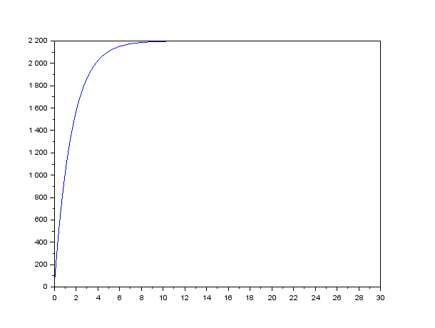
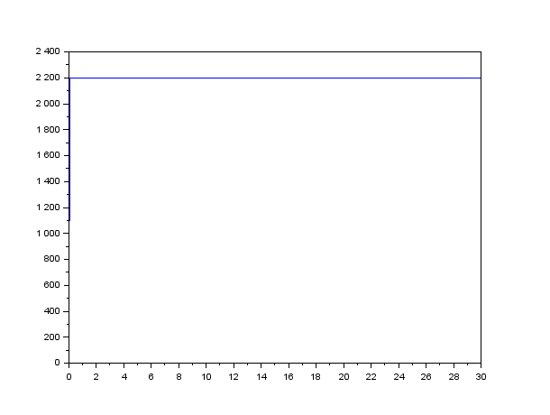
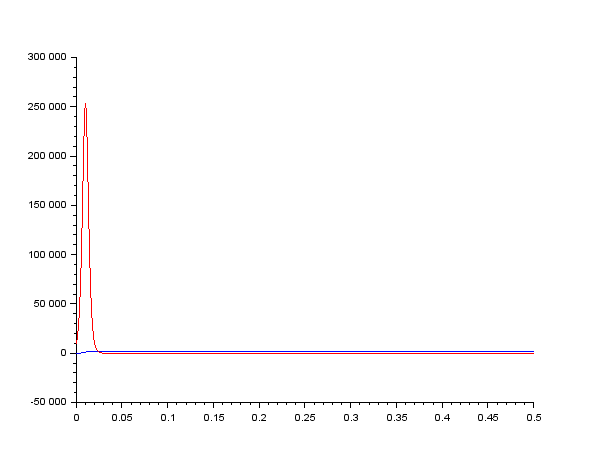
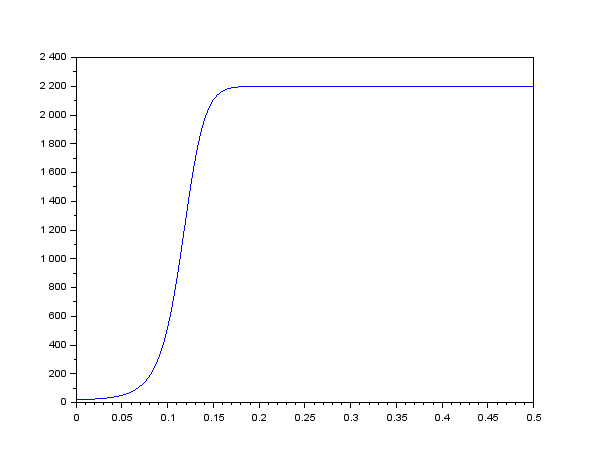

---
## Front matter
lang: ru-RU
title: Эффективность рекламы
author: |
	Гебриал Ибрам \inst{1}
	
institute: |
	\inst{1}RUDN University, Moscow, Russian Federation
	

## Formatting
toc: false
slide_level: 2
theme: metropolis
header-includes: 
 - \metroset{progressbar=frametitle,sectionpage=progressbar,numbering=fraction}
 - '\makeatletter'
 - '\beamer@ignorenonframefalse'
 - '\makeatother'
aspectratio: 43
section-titles: true
---

# Цель работы

## Цель работы

Посмотреть модель распространения рекламы.

## Задание

**Вариант 42**

Постройте график распространения рекламы, математическая модель которой описывается следующим уравнением:  

1. $\frac{dn}{dt}=(0.605+0.000017n(t))(N-n(t))$.  

2. $\frac{dn}{dt}=(0.000065+0.209n(t))(N-n(t))$.  

3. $\frac{dn}{dt}=(0.51sin(t)+0.31*t*n(t))(N-n(t))$.  

При этом объем аудитории $N$=2200, в начальный момент о товаре знает 21 человек. Для случая 2 определите в какой момент времени скорость распространения рекламы будет иметь максимальное значение.

# Выполнение работы

Математическая модель распространения рекламы описывается
уравнением:
 
$$\frac{dn}{dt}=(a_1(t)+a_2(t)n(t))(N-n(t))$$
  
При $\alpha{1}(t)$>>$\alpha{2}(t)$ получается модель типа модели Мальтуса

В обратном случае, при $\alpha{1}(t)$<<$\alpha{2}(t)$ получаем уравнение логистической кривой.

# Результат

## Первый случай $\alpha_{1}(t)$>$\alpha_{2}(t)$

График распространения рекламы для этого случая (рис. -@fig:001):  

{ #fig:001 width=70% }  

## второй случай $\alpha_{1}(t)$<$\alpha_{2}(t)$

График распространения рекламы для этого случая (рис. -@fig:002):  

{ #fig:002 width=70% } 

## определиние в какой момент времени скорость распространения рекламы будет иметь максимальное значение.

построить график производной (рис. -@fig:003):  

{ #fig:003 width=70% }  

Маскимальное значение в момент времени $t$=0.01.

## третий случай 

График распространения рекламы для этого случая (рис. -@fig:004): 

{ #fig:004 width=70% }  

# Вывод

Рассмотрел модель распространения рекламы.

## {.standout}

Спасибо за внимание 
