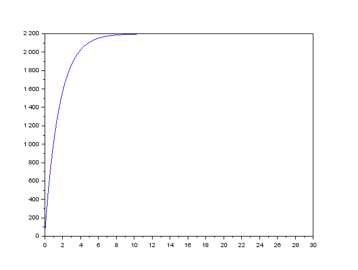
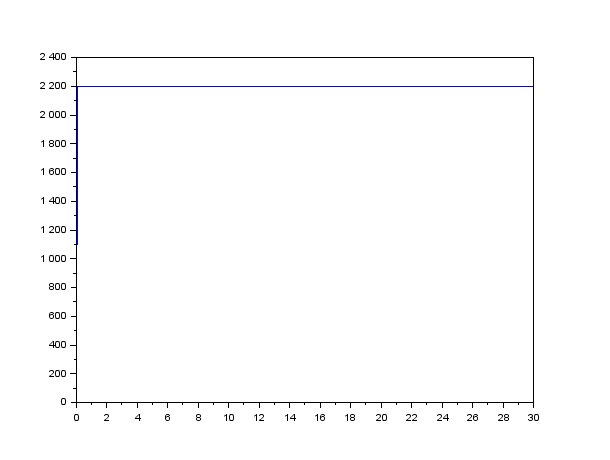
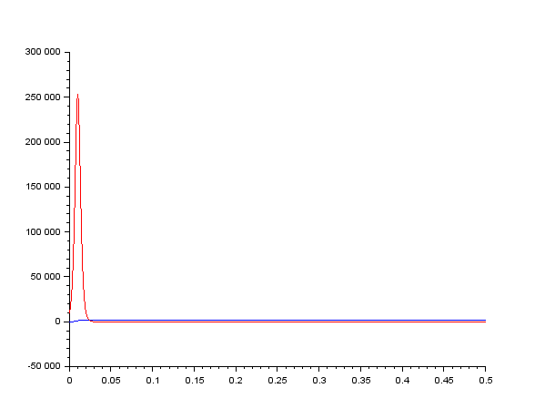
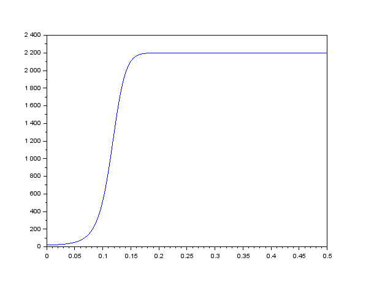

---
# Front matter
lang: ru-RU
title: "Отчёт по лабораторной работе 7"

author: "Гебриал Ибрам Есам Зекри НПИ-01-18"

# Formatting
toc-title: "Содержание"
toc: true # Table of contents
toc_depth: 2
lof: true # List of figures
lot: true # List of tables
fontsize: 12pt
linestretch: 1.5
papersize: a4paper
documentclass: scrreprt
polyglossia-lang: russian
polyglossia-otherlangs: english
mainfont: PT Serif
romanfont: PT Serif
sansfont: PT Sans
monofont: PT Mono
mainfontoptions: Ligatures=TeX
romanfontoptions: Ligatures=TeX
sansfontoptions: Ligatures=TeX,Scale=MatchLowercase
monofontoptions: Scale=MatchLowercase
indent: true
pdf-engine: lualatex
header-includes:
  - \linepenalty=10 # the penalty added to the badness of each line within a paragraph (no associated penalty node) Increasing the value makes tex try to have fewer lines in the paragraph.
  - \interlinepenalty=0 # value of the penalty (node) added after each line of a paragraph.
  - \hyphenpenalty=50 # the penalty for line breaking at an automatically inserted hyphen
  - \exhyphenpenalty=50 # the penalty for line breaking at an explicit hyphen
  - \binoppenalty=700 # the penalty for breaking a line at a binary operator
  - \relpenalty=500 # the penalty for breaking a line at a relation
  - \clubpenalty=150 # extra penalty for breaking after first line of a paragraph
  - \widowpenalty=150 # extra penalty for breaking before last line of a paragraph
  - \displaywidowpenalty=50 # extra penalty for breaking before last line before a display math
  - \brokenpenalty=100 # extra penalty for page breaking after a hyphenated line
  - \predisplaypenalty=10000 # penalty for breaking before a display
  - \postdisplaypenalty=0 # penalty for breaking after a display
  - \floatingpenalty = 20000 # penalty for splitting an insertion (can only be split footnote in standard LaTeX)
  - \raggedbottom # or \flushbottom
  - \usepackage{float} # keep figures where there are in the text
  - \floatplacement{figure}{H} # keep figures where there are in the text
---

# Цель работы

Посмотреть модель распространения рекламы.

# Задание

**Вариант 42**

Постройте график распространения рекламы, математическая модель которой описывается следующим уравнением:  

1. $\frac{dn}{dt}=(0.605+0.000017n(t))(N-n(t))$.  

2. $\frac{dn}{dt}=(0.000065+0.209n(t))(N-n(t))$.  

3. $\frac{dn}{dt}=(0.51sin(t)+0.31*t*n(t))(N-n(t))$.  


При этом объем аудитории $N$=2200, в начальный момент о товаре знает 21 человек. Для случая 2 определите в какой момент времени скорость распространения рекламы будет иметь максимальное значение.

# Выполнение лабораторной работы

## Теоретические сведения

Организуется рекламная кампания нового товара или услуги. Необходимо,
чтобы прибыль будущих продаж с избытком покрывала издержки на рекламу.
Вначале расходы могут превышать прибыль, поскольку лишь малая часть
потенциальных покупателей будет информирована о новинке. Затем, при
увеличении числа продаж, возрастает и прибыль, и, наконец, наступит момент,
когда рынок насытиться, и рекламировать товар станет бесполезным.  

Предположим, что торговыми учреждениями реализуется некоторая
продукция, о которой в момент времени $t$ из числа потенциальных покупателей $N$ знает лишь $n$ покупателей. Для ускорения сбыта продукции запускается реклама по радио, телевидению и других средств массовой информации. После запуска
рекламной кампании информация о продукции начнет распространяться среди
потенциальных покупателей путем общения друг с другом. Таким образом, после
запуска рекламных объявлений скорость изменения числа знающих о продукции
людей пропорциональна как числу знающих о товаре покупателей, так и числу
покупателей о нем не знающих.  

Модель рекламной кампании описывается следующими величинами.
Считаем, что
$\frac{dn}{dt}$
 - скорость изменения со временем числа потребителей,
узнавших о товаре и готовых его купить,
$t$ - время, прошедшее с начала рекламной
кампании,
$n(t)$ - число уже информированных клиентов. Эта величина
пропорциональна числу покупателей, еще не знающих о нем, это описывается
следующим образом:
$a_1(t)(N-n(t))$ , где
$N$ - общее число потенциальных
платежеспособных покупателей,
$a_1(t)>0$ - характеризует интенсивность
рекламной кампании (зависит от затрат на рекламу в данный момент времени).
Помимо этого, узнавшие о товаре потребители также распространяют полученную
информацию среди потенциальных покупателей, не знающих о нем (в этом случае
работает т.н. сарафанное радио). Этот вклад в рекламу описывается величиной
$a_2(t)n(t)(N-n(t))$ , эта величина увеличивается с увеличением потребителей
узнавших о товаре. Математическая модель распространения рекламы описывается
уравнением:
 $$\frac{dn}{dt}=(a_1(t)+a_2(t)n(t))(N-n(t))$$
  
При $\alpha{1}(t)$>>$\alpha{2}(t)$ получается модель типа модели Мальтуса, решение которой
имеет вид (рис. -@fig:001):  

{ #fig:001 width=70% } 

В обратном случае, при
$\alpha{1}(t)$<<$\alpha{2}(t)$
получаем уравнение логистической
кривой (рис. -@fig:002):  

{ #fig:002 width=70% }

## Выполнение работы

Нам в задании дано:

N=2200 -максимальное количество людей, которых может заинтересовать товар

x0=21 - количество людей, знающих о товаре в начальный момент времени


### Первый случай $\alpha_{1}(t)$>$\alpha_{2}(t)$

$$\frac{dn}{dt}=(0.605+0.000017n(t))(N-n(t))$$


Начальные условия:

$\alpha_{1} = 0.605$

$\alpha_{2} = 0.000017$

**Код программы** 

```
t0 = 0; //начальный момент времени
x0 = 21; // количество людей, знающих о товаре в начальный момент
времени
N = 2200; // максимальное количество людей, которых может
заинтересовать товар
t = 0: 0.1: 30; // временной промежуток (длительность рекламной
компании)
//функция, отвечающая за платную рекламу
function g=k(t);
g = 0.605;
endfunction
//функция, описывающая сарафанное радио
function v=p(t);
v = 0.000017;
endfunction
//уравнение, описывающее распространение рекламы
function xd=f(t, x);
xd = ( k(t) + p(t)*x )*( N - x );
endfunction
x = ode(x0, t0, t, f); //решение ОДУ
plot(t, x); //построение графика решения

```

График распространения рекламы для этого случая (рис. -@fig:003):  

{ #fig:003 width=70% }  

Получил модель типа модели Мальтуса.

### второй случай $\alpha_{1}(t)$<$\alpha_{2}(t)$

$$\frac{dn}{dt}=(0.000065+0.209n(t))(N-n(t))$$

Начальные условия:

$\alpha_{1} = 0.000065$

$\alpha_{2} = 0.209$


**Код программы** 

```
t0 = 0; //начальный момент времени
x0 = 21; // количество людей, знающих о товаре в начальный момент
времени
N = 2200; // максимальное количество людей, которых может
заинтересовать товар
t = 0: 0.1: 30; // временной промежуток (длительность рекламной
компании)
//функция, отвечающая за платную рекламу
function g=k(t);
g = 0.000065;
endfunction
//функция, описывающая сарафанное радио
function v=p(t);
v = 0.209;
endfunction
//уравнение, описывающее распространение рекламы
function xd=f(t, x);
xd = ( k(t) + p(t)*x )*( N - x );
endfunction
x = ode(x0, t0, t, f); //решение ОДУ
plot(t, x); //построение графика решения

```


График распространения рекламы для этого случая (рис. -@fig:004):  

{ #fig:004 width=70% } 

Получил уравнение логистической кривой. 

#### определиние в какой момент времени скорость распространения рекламы будет иметь максимальное значение.


Я добавил в программе чтобы построить график производной (рис. -@fig:006):  
```

n=size(x,"c");
for i=1:n
  dx(i)=(k(t)+p(t)*x(i))*(N-x(i));  
end
```

{ #fig:006 width=70% }  

Маскимальное значение в момент времени $t$=0.01.

### третий случай 

$$\frac{dn}{dt}=(0.51sin(t)+0.31*t*n(t))(N-n(t))$$


Начальные условия:

$\alpha_{1} = 0.51sin(t)$

$\alpha_{2} = 0.31*t$

**Код программы** 

```
t0 = 0; //начальный момент времени
x0 = 21; // количество людей, знающих о товаре в начальный момент
времени
N = 2200; // максимальное количество людей, которых может
заинтересовать товар
t = 0: 0.1: 30; // временной промежуток (длительность рекламной
компании)
//функция, отвечающая за платную рекламу
function g=k(t);
g = 0.51;
endfunction
//функция, описывающая сарафанное радио
function v=p(t);
v = 0.31;
endfunction
//уравнение, описывающее распространение рекламы
function xd=f(t, x);
xd=(k(t)*sin(t)+p(t)*t*x)*(N-x);
endfunction
x = ode(x0, t0, t, f); //решение ОДУ
plot(t, x); //построение графика решения

```

График распространения рекламы для этого случая (рис. -@fig:008): 

{ #fig:008 width=70% }  

Получаем уравнение логистической кривой.

## Контрольные вопросы к лабораторной работе

1. Записать модель Мальтуса (дать пояснение, где используется данная модель).  

модель типа модели Мальтуса:  

$$\frac{dn}{dt}=(a_1(t)+a_2(t)n(t))(N-n(t))$$

В случае $\alpha_{1}(t)$>>$\alpha_{2}(t)$.

Он широко используется в популяционной экологии как первый
принцип популяционной динамики. Мальтус писал, что для всех форм жизни,
располагающих избытком ресурсов, характерен экспоненциальный рост популяции.
Тем не менее, в какой-то момент ресурсов начинает недоставать, и рост замедляется.

2. Записать уравнение логистической кривой (дать пояснение, что описывает данное уравнение). 

$\frac{dn}{dt}=(a_1(t)+a_2(t)n(t))(N-n(t))$ 
при  В случае $\alpha_{1}(t)$<<$\alpha_{2}(t)$.


3. На что влияет коэффициент $\alpha_{1}(t)$ и $\alpha_{2}(t)$ в модели распространенияn рекламы.  

Интенсивность рекламной кампании и сарафанное радио

4. Как ведет себя рассматриваемая модель при $a_1(t)>>a_2(t)$.  

Модель типа модели Мальтуса (рис. -@fig:009):  

{ #fig:009 width=70% }  


5. Как ведет себя рассматриваемая модель при $a_1(t)<<a_2(t)$. 

уравнение логистической кривой.  (рис. -@fig:010):  

{ #fig:010 width=70% } 


# Выводы

Рассмотрел модель распространения рекламы.