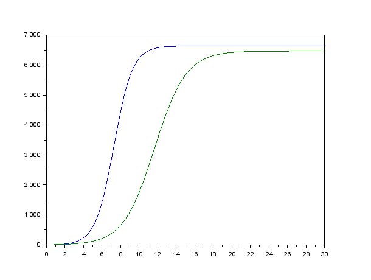
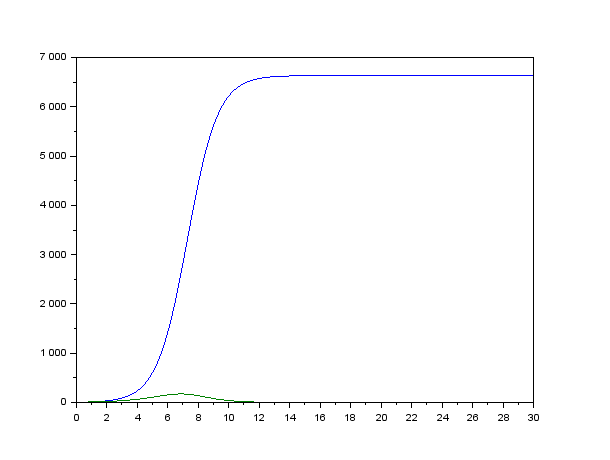

---
## Front matter
lang: ru-RU
title: Модель конкуренции двух фирм
author: |
	Гебриал Ибрам \inst{1}
	
institute: |
	\inst{1}RUDN University, Moscow, Russian Federation
	

## Formatting
toc: false
slide_level: 2
theme: metropolis
header-includes: 
 - \metroset{progressbar=frametitle,sectionpage=progressbar,numbering=fraction}
 - '\makeatletter'
 - '\beamer@ignorenonframefalse'
 - '\makeatother'
aspectratio: 43
section-titles: true
---

# Цель работы

## Цель работы

Посмотреть Модель конкуренции двух фирм.

## Задание

**Вариант 42**

**Случай 1.** 

$$\frac{dM_1}{d\theta}=M_1-\frac{b}{c_1}M_1M_2-\frac{a_1}{c_1}M_1^2 ,$$

$$\frac{dM_2}{d\theta}=\frac{c_2}{c_1}M_2-\frac{b}{c_1}M_1M_2-\frac{a_2}{c_1}M_2^2$$

где $a_1=\frac{p_{cr}}{\tau_1^2\widetilde{p}_1^2Nq}$, $a_2=\frac{p_{cr}}{\tau_2^2\widetilde{p}_2^2Nq}$, $b=\frac{p_{cr}}{\tau_1^2\widetilde{p}_1^2\tau_2^2\widetilde{p}_2^2Nq}$, $c_1=\frac{p_{cr}-\widetilde{p}_1}{\tau_1\widetilde{p}_1}$, $c_2=\frac{p_{cr}-\widetilde{p}_2}{\tau_2\widetilde{p}_2}$.  
Также введена нормировка $t=c_1\theta$.

## 

**Случай 2.** 

$$\frac{dM_1}{d\theta}=M_1-\frac{b}{c_1}M_1M_2-\frac{a_1}{c_1}M_1^2 ,$$

$$\frac{dM_2}{d\theta}=\frac{c_2}{c_1}M_2-(\frac{b}{c_1}+0.00022)M_1M_2-\frac{a_2}{c_1}M_2^2$$

Также введена нормировка $t=c_1\theta$.

Для обоих случаев рассмотрим задачу со следующими начальными условиями и параметрами:
${M_1}_0=4.5, {M_2}_0=6.5, p_cr=24, N=54, q=1, \tau_1=24, \tau_2=20, \widetilde{p}_1=7.4, \widetilde{p}_2=11.4$.  

## 

**Обозначения:**  
$N$ - число потребителей производимого продукта.  
$\tau$ - длительность производственного цикла.  
$p$ - рыночная цена товара.  
$\widetilde{p}$ - себестоимость продукта, то есть переменные издержки на производство единицы
продукции.  
$q$ - максимальная потребность одного человека в продукте в единицу времени.  
$\theta=\frac{t}{c_1}$ - безразмерное время.  

## Задание

1. Постройте графики изменения оборотных средств фирмы 1 и фирмы 2 без учета постоянных издержек и с веденной нормировкой для случая 1.

2. Постройте графики изменения оборотных средств фирмы 1 и фирмы 2 без учета постоянных издержек и с веденной нормировкой для случая 2.

# Результат

## Случай 1: Построение графиков изменения оборотных средств фирм при влиянии только экономического фактора

Построил график изменения оборотных средств фирм для первого случая (рис. -@fig:001):  

{ #fig:001 width=70% }  
 

## Случай 2: Построение графиков изменения оборотных средств фирм при влиянии помимо экономического фактора еще и еще и социально-психологических факторов

Построил график изменения оборотных средств фирм для второго случая (рис. -@fig:002):  

{ #fig:002 width=70% }  

# Вывод

Рассмотрел модель конкуренции двух фирм.

## {.standout}

Спасибо за внимание 
