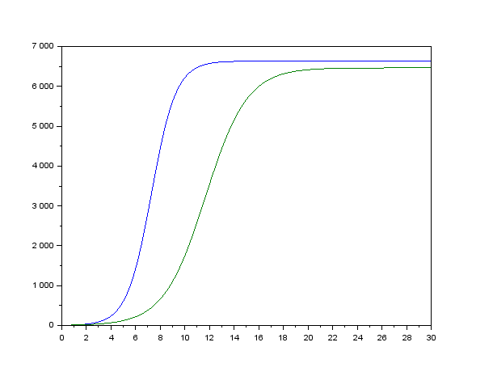

---
# Front matter
lang: ru-RU
title: "Отчёт по лабораторной работе 8"

author: "Гебриал Ибрам Есам Зекри НПИ-01-18"

# Formatting
toc-title: "Содержание"
toc: true # Table of contents
toc_depth: 2
lof: true # List of figures
lot: true # List of tables
fontsize: 12pt
linestretch: 1.5
papersize: a4paper
documentclass: scrreprt
polyglossia-lang: russian
polyglossia-otherlangs: english
mainfont: PT Serif
romanfont: PT Serif
sansfont: PT Sans
monofont: PT Mono
mainfontoptions: Ligatures=TeX
romanfontoptions: Ligatures=TeX
sansfontoptions: Ligatures=TeX,Scale=MatchLowercase
monofontoptions: Scale=MatchLowercase
indent: true
pdf-engine: lualatex
header-includes:
  - \linepenalty=10 # the penalty added to the badness of each line within a paragraph (no associated penalty node) Increasing the value makes tex try to have fewer lines in the paragraph.
  - \interlinepenalty=0 # value of the penalty (node) added after each line of a paragraph.
  - \hyphenpenalty=50 # the penalty for line breaking at an automatically inserted hyphen
  - \exhyphenpenalty=50 # the penalty for line breaking at an explicit hyphen
  - \binoppenalty=700 # the penalty for breaking a line at a binary operator
  - \relpenalty=500 # the penalty for breaking a line at a relation
  - \clubpenalty=150 # extra penalty for breaking after first line of a paragraph
  - \widowpenalty=150 # extra penalty for breaking before last line of a paragraph
  - \displaywidowpenalty=50 # extra penalty for breaking before last line before a display math
  - \brokenpenalty=100 # extra penalty for page breaking after a hyphenated line
  - \predisplaypenalty=10000 # penalty for breaking before a display
  - \postdisplaypenalty=0 # penalty for breaking after a display
  - \floatingpenalty = 20000 # penalty for splitting an insertion (can only be split footnote in standard LaTeX)
  - \raggedbottom # or \flushbottom
  - \usepackage{float} # keep figures where there are in the text
  - \floatplacement{figure}{H} # keep figures where there are in the text
---

# Цель работы

Посмотреть модель конкуренции двух фирм.

# Задание

**Вариант 42**

**Случай 1.** 

Рассмотрим две фирмы, производящие взаимозаменяемые товары одинакового качества и находящиеся в одной рыночной нише. В рамках
этой модели конкурентная борьба ведётся только рыночными методами. То есть,
конкуренты не могут прямо вмешиваться в  ситуацию на рынке и каким-либо способом влиять на потребителей. Будем считать, что постоянные издержки пренебрежимо малы, и в
модели учитывать не будем. В этом случае динамика изменения объемов продаж фирмы 1 и фирмы 2 описывается следующей системой уравнений:

$$\frac{dM_1}{d\theta}=M_1-\frac{b}{c_1}M_1M_2-\frac{a_1}{c_1}M_1^2 ,$$

$$\frac{dM_2}{d\theta}=\frac{c_2}{c_1}M_2-\frac{b}{c_1}M_1M_2-\frac{a_2}{c_1}M_2^2$$

где $a_1=\frac{p_{cr}}{\tau_1^2\widetilde{p}_1^2Nq}$, $a_2=\frac{p_{cr}}{\tau_2^2\widetilde{p}_2^2Nq}$, $b=\frac{p_{cr}}{\tau_1^2\widetilde{p}_1^2\tau_2^2\widetilde{p}_2^2Nq}$, $c_1=\frac{p_{cr}-\widetilde{p}_1}{\tau_1\widetilde{p}_1}$, $c_2=\frac{p_{cr}-\widetilde{p}_2}{\tau_2\widetilde{p}_2}$.  
Также введена нормировка $t=c_1\theta$.

**Случай 2.** 

Рассмотрим модель, когда, помимо экономического фактора влияния, используются еще и социально-психологические факторы – формирование общественного предпочтения одного товара другому, не зависимо от их качества и цены. В этом случае взаимодействие двух фирм будет зависеть друг от друга, соответственно коэффициент перед $M_1M_2$ будет отличаться. Пусть в рамках рассматриваемой модели динамика изменения объемов продаж фирмы 1 и фирмы 2 описывается следующей системой уравнений:

$$\frac{dM_1}{d\theta}=M_1-\frac{b}{c_1}M_1M_2-\frac{a_1}{c_1}M_1^2 ,$$

$$\frac{dM_2}{d\theta}=\frac{c_2}{c_1}M_2-(\frac{b}{c_1}+0.00022)M_1M_2-\frac{a_2}{c_1}M_2^2$$
г
де $a_1=\frac{p_{cr}}{\tau_1^2\widetilde{p}_1^2Nq}$, $a_2=\frac{p_{cr}}{\tau_2^2\widetilde{p}_2^2Nq}$, $b=\frac{p_{cr}}{\tau_1^2\widetilde{p}_1^2\tau_2^2\widetilde{p}_2^2Nq}$, $c_1=\frac{p_{cr}-\widetilde{p}_1}{\tau_1\widetilde{p}_1}$, $c_2=\frac{p_{cr}-\widetilde{p}_2}{\tau_2\widetilde{p}_2}$.  

Также введена нормировка $t=c_1\theta$.

Для обоих случаев рассмотрим задачу со следующими начальными условиями и параметрами:
${M_1}_0=4.5, {M_2}_0=6.5, p_cr=24, N=54, q=1, \tau_1=24, \tau_2=20, \widetilde{p}_1=7.4, \widetilde{p}_2=11.4$.  

**Замечание:** Значения $p_{cr}, \widetilde{p}_{1,2}, N$ указаны в тысячах единиц, а значения $M_{1,2}$ указаны в млн. единиц.  

**Обозначения:**  
$N$ - число потребителей производимого продукта.  
$\tau$ - длительность производственного цикла.  
$p$ - рыночная цена товара.  
$\widetilde{p}$ - себестоимость продукта, то есть переменные издержки на производство единицы
продукции.  
$q$ - максимальная потребность одного человека в продукте в единицу времени.  
$\theta=\frac{t}{c_1}$ - безразмерное время.  


1. Постройте графики изменения оборотных средств фирмы 1 и фирмы 2 без учета постоянных издержек и с веденной нормировкой для случая 1.

2. Постройте графики изменения оборотных средств фирмы 1 и фирмы 2 без учета постоянных издержек и с веденной нормировкой для случая 2.


# Выполнение лабораторной работы

## Теоретические сведения

### Модель одной фирмы

Для построения модели конкуренции хотя бы двух фирм необходимо
рассмотреть модель одной фирмы. Вначале рассмотрим модель фирмы,
производящей продукт долговременного пользования, когда цена его определяется
балансом спроса и предложения. Примем, что этот продукт занимает
определенную нишу рынка и конкуренты в ней отсутствуют.

Обозначим:

Обозначим:  
$N$ - число потребителей производимого продукта.  
$S$ - доходы потребителей данного продукта. Считаем, что доходы всех
потребителей одинаковы. Это предположение справедливо, если речь идет об
одной рыночной нише, т.е. производимый продукт ориентирован на определенный
слой населения.  
$M$ - оборотные средства предприятия.  
$\tau$ - длительность производственного цикла.  
$p$ - рыночная цена товара.
$\widetilde{p}$ - себестоимость продукта, то есть переменные издержки на производство
единицы продукции.  
$\delta$ - доля оборотных средств, идущая на покрытие переменных издержек.  
$\kappa$ - постоянные издержки, которые не зависят от количества выпускаемой
продукции.  
$q$ - максимальная потребность одного человека в продукте в единицу времени


$Q(S/p)$ – функция спроса, зависящая от отношения дохода $S$ к цене $p$. Она равна количеству продукта, потребляемого одним потребителем в единицу времени.

Функцию спроса товаров долговременного использования часто представляют в простейшей форме: 

$$Q = q - \kappa\frac{p}{S} = q(1 - \frac{p}{p_{cr}})$$

где $q$ – максимальная потребность одного человека в продукте в единицу времени.
Эта функция падает с ростом цены и при $p = p_{cr}$ (критическая стоимость продукта) потребители отказываются от приобретения товара. Величина $p_{cr} = Sq/\kappa$. Параметр $\kappa$ – мера эластичности функции спроса по цене. Таким образом, функция спроса является пороговой (то есть, $Q(S/p) = 0$ при $p \geq p_{cr}$) и обладает свойствами насыщения.

Уравнения динамики оборотных средств можно записать в виде:

$$\frac{dM}{dt} = -\frac{M \delta}{\tau} + NQp - \kappa = -\frac{M\delta}{\tau} + Nq(1 - \frac{p}{p_{cr}})p - \kappa$$

Уравнение для рыночной цены $p$ представим в виде:

$$\frac{dp}{dt} = \gamma (-\frac{M\delta}{\tau \widetilde{p}} + Nq(1-\frac{p}{p_{cr}}) )$$

Первый член соответствует количеству поставляемого на рынок товара (то есть, предложению), а второй член – спросу.
Параметр $\gamma$ зависит от скорости оборота товаров на рынке. Как правило, время торгового оборота существенно меньше времени производственного цикла $\tau$. При заданном M уравнение описывает быстрое стремление цены к равновесному значению цены, которое устойчиво.

В этом случае уравнение можно заменить алгебраическим соотношением

$$ -\frac{M\delta}{\tau \widetilde{p}} + Nq(1-\frac{p}{p_{cr}}) = 0$$

равновесное значение цены $p$ равно

$$ p = p_{cr}(1 - \frac{M\delta}{\tau \widetilde{p} Nq})$$

Тогда уравнения динамики оборотных средств приобретает вид

$$\frac{dM}{dt} = -\frac{M \delta}{\tau}(\frac{p}{p_{cr}}-1) - M^2 ( \frac{\delta}{\tau \widetilde{p} })^2 \frac{p_{cr}}{Nq} - \kappa$$

Это уравнение имеет два стационарных решения, соответствующих условию $dM/dt=0$

$$ \widetilde{M_{1,2}} = \frac{1}{2} a \pm \sqrt{\frac{a^2}{4} - b}$$

где

$$ a = Nq(1 - \frac{\widetilde{p}}{p_{cr}} \widetilde{p} \frac{\tau}{\delta}), b = kNq \frac{(\tau \widetilde{p})^2}{p_{cr}\delta ^2} $$

Получается, что при больших постоянных издержках (в случае $a^2 < 4b$) стационарных состояний нет. Это означает, что в этих условиях фирма не может функционировать стабильно, то есть, терпит банкротство. Однако, как правило, постоянные затраты малы по сравнению с переменными (то есть, $b << a^2$) и играют роль, только в случае, когда оборотные средства малы. 

При $b << a$ стационарные значения $M$ равны

$$ \widetilde{M_{+}} = Nq \frac{\tau}{\delta}(1 - \frac{\widetilde{p}}{p_{cr}})\widetilde{p}, \widetilde{M_{-}} = \kappa\widetilde{p} \frac{\tau}{\delta(p_{cr} - \widetilde{p})} $$

Первое состояние $\widetilde{M_{+}}$ устойчиво и соответствует стабильному функционированию предприятия. Второе состояние $\widetilde{M_{-}}$ неустойчиво, так, что при $M < \widetilde{M_{-}}$ оборотные средства падают ($dM/dt < 0$), то есть, фирма идет к банкротству. По смыслу $\widetilde{M_{-}}$ соответствует начальному капиталу, необходимому для входа в рынок.

В обсуждаемой модели параметр $\delta$ всюду входит в сочетании с $\tau$. Это значит, что уменьшение доли оборотных средств, вкладываемых в производство, эквивалентно удлинению производственного цикла. Поэтому мы в дальнейшем положим: $\delta = 1$, а параметр $\tau$ будем считать временем цикла, с учётом сказанного.


### Конкуренция двух фирм

***Случай 1***  

Рассмотрим две фирмы, производящие взаимозаменяемые товары
одинакового качества и находящиеся в одной рыночной нише. Последнее означает,
что у потребителей в этой нише нет априорных предпочтений, и они приобретут
тот или иной товар, не обращая внимания на знак фирмы.
В этом случае, на рынке устанавливается единая цена, которая определяется
балансом суммарного предложения и спроса. Иными словами, в рамках нашей
модели конкурентная борьба ведётся только рыночными методами. То есть,
конкуренты могут влиять на противника путем изменения параметров своего
производства: себестоимость, время цикла, но не могут прямо вмешиваться в
ситуацию на рынке («назначать» цену или влиять на потребителей какимлибо иным способом.)
Уравнения динамики оборотных средств запишем в виде
$$\frac{dM_1}{dt}=-\frac{M_1}{\tau_1}-N_1q(1-\frac{p}{p_{cr}})p-\kappa_1$$
$$\frac{dM_2}{dt}=-\frac{M_2}{\tau_2}-N_2q(1-\frac{p}{p_{cr}})p-\kappa_2$$
где использованы те же обозначения, а индексы 1 и 2 относятся к первой и второй
фирме, соответственно. Величины $N_1$ и $N_2$ – числа потребителей, приобретших
товар первой и второй фирмы.  

Учтем, что товарный баланс устанавливается быстро, то есть,
произведенный каждой фирмой товар не накапливается, а реализуется по цене $p$. Тогда 
$$\frac{dM_1}{dt}=-\frac{M_1}{\tau_1}(1-\frac{p}{\widetilde{p}_1})-\kappa_1$$
$$\frac{dM_2}{dt}=-\frac{M_2}{\tau_2}(1-\frac{p}{\widetilde{p}_2})-\kappa_2$$

Считая, как и выше, что ценовое равновесие устанавливается быстро,
имеем
$$\frac{dM_1}{dt}=c_1M_1-bM_1M_2-a_1M_1^2-\kappa_1$$
$$\frac{dM_2}{dt}=c_2M_2-bM_1M_2-a_2M_2^2-\kappa_2$$
где
$a_1=\frac{p_{cr}}{\tau_1^2\widetilde{p}_1^2Nq}$, $a_2=\frac{p_{cr}}{\tau_2^2\widetilde{p}_2^2Nq}$, $b=\frac{p_{cr}}{\tau_1^2\widetilde{p}_1^2\tau_2^2\widetilde{p}_2^2Nq}$, $c_1=\frac{p_{cr}-\widetilde{p}_1}{\tau_1\widetilde{p}_1}$, $c_2=\frac{p_{cr}-\widetilde{p}_2}{\tau_2\widetilde{p}_2}$.  

Исследуем систему в случае, когда постоянные издержки $(\kappa_1, \kappa_2)$ пренебрежимо малы. И введем нормировку $t=c_1\theta$. Получим следующую систему
$$\frac{dM_1}{d\theta}=M_1-\frac{b}{c_1}M_1M_2-\frac{a_1}{c_1}M_1^2 ,$$
$$\frac{dM_2}{d\theta}=\frac{c_2}{c_1}M_2-\frac{b}{c_1}M_1M_2-\frac{a_2}{c_1}M_2^2$$

***Случай 2***  

Рассмотрим модель, когда, помимо экономического фактора влияния
(изменение себестоимости, производственного цикла, использование кредита и
т.п.), используются еще и социально-психологические факторы – формирование
общественного предпочтения одного товара другому, не зависимо от их качества и
цены. В этом случае взаимодействие двух фирм будет зависеть друг от друга,
соответственно коэффициент перед
$M_1M_2$
будет отличаться. 
$$\frac{dM_1}{d\theta}=M_1-\frac{b}{c_1}M_1M_2-\frac{a_1}{c_1}M_1^2 ,$$
$$\frac{dM_2}{d\theta}=\frac{c_2}{c_1}M_2-(\frac{b}{c_1}+0.00022)M_1M_2-\frac{a_2}{c_1}M_2^2$$


## Выполнение работы

Нам в задании дано:

${M_1}_0=4.5, {M_2}_0=6.5,$ 
$p_cr=24, N=54, q=1, \tau_1=24, \tau_2=20, \widetilde{p}_1=7.4, \widetilde{p}_2=11.4$.


### Случай 1: Построение графиков изменения оборотных средств фирм при влиянии только экономического фактора

Математическая модель для этого случая имеет вид
$$\frac{dM_1}{d\theta}=M_1-\frac{b}{c_1}M_1M_2-\frac{a_1}{c_1}M_1^2 ,$$
$$\frac{dM_2}{d\theta}=\frac{c_2}{c_1}M_2-\frac{b}{c_1}M_1M_2-\frac{a_2}{c_1}M_2^2$$


**Код программы** 

```
p_cr=24;//крическая стоимость продукта
tau1=24;//длительность производственного цикла фирма 1
p1=7.4;//себестоимость прдукта у фирмы 1
tau2=20;//длительность производственного цикла фирма 2
p2=11.4;//себестоимость прдукта у фирмы 2
N=54;//число потребителей производимого продукта.
q =1;// максимальная потребность одного человека 
в продукте в единицу времени

a1=p_cr/(tau1*tau1*p1*p1*N*q);
a2=p_cr/(tau2*tau2*p2*p2*N*q);
b=p_cr/(tau1*tau1*tau2*tau2*p1*p1*p2*p2*N*q);
c1=(p_cr-p1)/(tau1*p1);
c2=(p_cr-p2)/(tau2*p2);

function dx=syst(t,x)
dx(1)=(c1/c1)*x(1)-(a1/c1)*x(1)*x(1)-(b/c1)*x(1)*x(2);
dx(2)=(c2/c1)*x(2)-(a2/c1)*x(2)*x(2)-(b/c1)*x(1)*x(2);
endfunction 

t0=0;
x0=[4.5;6.5];
t=[0:0.01:30];
y=ode(x0,t0,t,syst);
n=size(y,"c");
plot(t,y);


```

Построил график изменения оборотных средств фирм для первого случая (рис. -@fig:001):  

{ #fig:001 width=70% }  

По графику видно, что рост оборотных средств предприятий идет
независимо друг от друга. В математической модели этот факт отражается в коэффициенте, стоящим перед членом $M_1M_2$: в рассматриваемой задаче он одинаковый в обоих уравнениях ($\frac{b}{c_1}$). Это было обозначено в условиях задачи.  

Каждая фирма достигает свое максимальное значение объема продаж и остается на
рынке с этим значением, то есть каждая фирма захватывает свою часть рынка
потребителей, которая не изменяется. 

### Случай 2: Построение графиков изменения оборотных средств фирм при влиянии помимо экономического фактора еще и еще и социально-психологических факторов

  
Математическая модель для этого случая имеет вид
$$\frac{dM_1}{d\theta}=M_1-\frac{b}{c_1}M_1M_2-\frac{a_1}{c_1}M_1^2 ,$$
$$\frac{dM_2}{d\theta}=\frac{c_2}{c_1}M_2-(\frac{b}{c_1}+0.00022)M_1M_2-\frac{a_2}{c_1}M_2^2$$


**Код программы** 

```
p_cr=24;//крическая стоимость продукта
tau1=24;//длительность производственного цикла фирма 1
p1=7.4;//себестоимость прдукта у фирмы 1
tau2=20;//длительность производственного цикла фирма 2
p2=11.4;//себестоимость прдукта у фирмы 2
N=54;//число потребителей производимого продукта.
q =1;// максимальная потребность одного 
человека в продукте в единицу времени

a1=p_cr/(tau1*tau1*p1*p1*N*q);
a2=p_cr/(tau2*tau2*p2*p2*N*q);
b=p_cr/(tau1*tau1*tau2*tau2*p1*p1*p2*p2*N*q);
c1=(p_cr-p1)/(tau1*p1);
c2=(p_cr-p2)/(tau2*p2);

function dx=syst(t,x)
dx(1)=(c1/c1)*x(1)-(a1/c1)*x(1)*x(1)-(b/c1)*x(1)*x(2);
dx(2)=(c2/c1)*x(2)-(a2/c1)*x(2)*x(2)-((b/c1)+0.00022)*x(1)*x(2);
endfunction 

t0=0;
x0=[4.5;6.5];
t=[0:0.01:30];
y=ode(x0,t0,t,syst);
n=size(y,"c");
plot(t,y);


```


Построил график изменения оборотных средств фирм для второго случая (рис. -@fig:002):  

{ #fig:002 width=70% }  

По графику видно, что первая фирма, несмотря на начальный рост,достигнув своего максимального объема продаж, начитает нести убытки и, в итоге, терпит банкротство. Динамика роста объемов оборотных средств второй фирмы
остается без изменения: достигнув максимального значения, остается на этом уровне.


# Выводы

Рассмотрел модель конкуренции двух фирм.